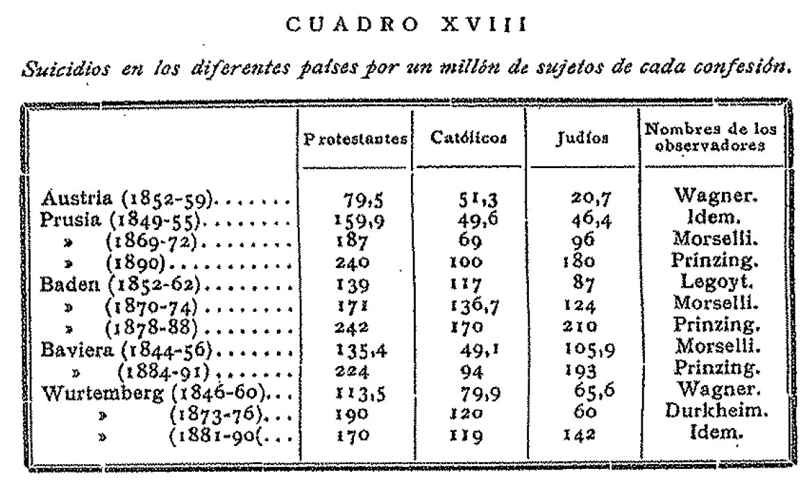
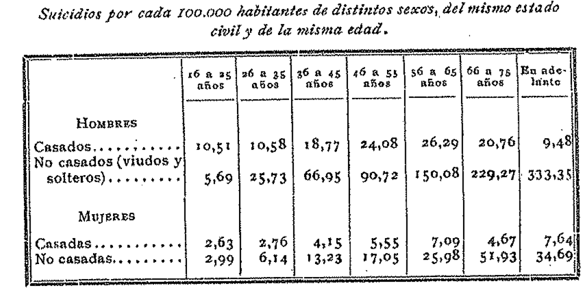
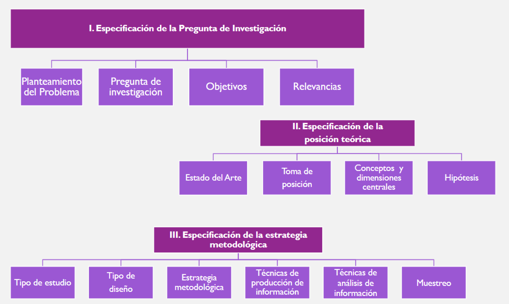

## Presentación {.smaller background-color="white"}

La estadística es una herramienta esencial para el quehacer sociológico moderno. Este curso busca entregar las herramientas básicas para relacionar la recolección de datos cuantitativos con las técnicas estadísticas apropiadas para su análisis, lectura e interpretación.

Se abordarán elementos de la estadística descriptiva univariada y bivariada, como la presentación de datos en tablas y gráficos, el cálculo de estadísticos (tendencia central, dispersión, etc.) y nociones de asociación.

El curso tiene un carácter eminentemente práctico, utilizando lenguajes de programación como **R** para el análisis y presentación de datos, buscando que los y las estudiantes comprendan la relevancia del análisis estadístico en las Ciencias Sociales.

## Resultados de Aprendizaje {background-color="white"}

**Resultado general:** Aplicar los métodos y herramientas de la estadística descriptiva necesarios para el análisis de datos cuantitativos en las ciencias sociales.

## Resultados Específicos {.smaller background-color="white"}

1.  Comprender el uso y relevancia de la estadística en las Ciencias Sociales.\
2.  Relacionar metodologías de recolección de datos y las técnicas estadísticas apropiadas para su análisis.\
3.  Comprender las principales herramientas de la estadística descriptiva.\
4.  Definir correctamente un plan de análisis descriptivo para una tabla de datos.\
5.  Identificar el estadístico apropiado según el tipo de variable analizada.\
6.  Manipular y analizar tablas de datos a través del lenguaje de programación R.\
7.  Interpretar datos cuantitativos producidos por investigaciones propias o de terceros.\
8.  Distinguir entre estadística descriptiva e inferencial.

## Contenidos: Unidad 1 {.smaller .dark-background}

### 1. Introducción a la estadística y su relación con las ciencias sociales

-   El proceso de conocimiento científico: lógica inductiva y deductiva.
-   Etapas generales de la investigación social empírica.
-   Datos: la fuente de información clave para la estadística.
-   La estadística como una aproximación a preguntas de investigación sociológicas.
-   Usos de la estadística en la actualidad: sociología, ciencia política, economía, políticas públicas.
-   La relevancia de los lenguajes de programación para el análisis estadístico actual.

## Contenidos: Unidad 2 {.smaller .dark-background}

### 2. Conceptos claves para la investigación social

-   Conceptualización y operacionalización.
-   Unidad de análisis vs. unidad de observación.
-   Tipos de variables y niveles de medición.
-   Muestra y población: estadísticos muestrales y parámetros poblacionales.
-   Población objetivo, marco muestral, muestra.
-   Validez y confiabilidad en la medición.
-   Error de medición y error muestral.

## Contenidos: Unidad 3 {.smaller .dark-background}

### 3. Marcos de datos para la investigación social

-   Estructura de una tabla de datos: lógica filas, columnas.
-   Exploración de una tabla de datos en R.
-   Tipos de variables en una tabla de datos.
-   Introducción al `tidyverse`.
-   Manipulación de tablas de datos I: selecciones, filtros, ordenamiento.
-   Manipulación de tablas de datos II: uniones y pivot.
-   Recodificación de variables: uso de estructuras condicionales.
-   Construcción de variables: índices, escalas y tipologías.

## Contenidos: Unidad 4 {.smaller .dark-background}

### 4. Estadística Descriptiva Univariada

-   **Estadísticos para variables numéricas:**
    -   Centro: media, mediana, moda.
    -   Dispersión: rango, varianza, desviación estándar.
    -   Posición: percentiles.
    -   Forma: asimetría y curtosis.
-   **Estadístico para variables discretas o categóricas:**
    -   Frecuencias absolutas y relativas, Porcentajes, Tasas.
-   **Visualización de datos:** barras, histogramas y boxplots.

## Contenidos: Unidad 5 {.smaller .dark-background}

### 5. Estadística Descriptiva Bivariada

-   Tipos de asociaciones entre variables según su naturaleza.
-   Concepto de independencia.
-   Construcción de estadísticos por grupo.
-   Construcción de tablas de contingencia y control por tercera variable.
-   Visualizaciones bivariadas: barras, histogramas y boxplots.
-   Medidas de asociación: Pearson, spearman, gamma, policóricas.
-   Más allá de lo descriptivo: la probabilidad como medida de incertidumbre.

## Evaluaciones {.smaller .dark-background}

| Evaluación | Descripción | Ponderación (NP) |
|:-----------------------|:-----------------------|:-----------------------|
| **Trabajos Prácticos (TP)** | 2 trabajos en grupo | 30% |
| **Controles (CONT)** | 5 controles individuales (se borra el peor) | 10% |
| **Tareas de R (TAR)** | 4 tareas individuales en R | 10% |
| **Pruebas Solemnes (PS)** | 2 pruebas (06/10 y 01/12) | 50% |

-   La **Nota de Presentación (NP)** corresponde al **70%** de la nota final del curso.
-   El **Examen Final** (fecha por confirmar) corresponde al **30%** restante.
-   Se requiere **70% de asistencia** para aprobar.

## Ayudantías {background-color="white"}

El curso cuenta con un equipo de tres ayudantes:

-   **Felipe Adasme** [felipe.adasme\@mail.udp.cl](mailto:felipe.adasme@mail.udp.cl)
-   **Francisca Hernández** [francisca.hernandez_c\@mail.udp.cl](mailto:francisca.hernandez_c@mail.udp.cl)
-   **Romina Zamorano** [romina.zamorano\@mail.udp.cl](mailto:romina.zamorano@mail.udp.cl)

**Horario de Ayudantías:**\
- Grupo 1: Lunes 14:30 - 15:50\
- Grupo 2: Lunes 14:30 - 15:50

Se realizarán 10 sesiones prácticas en R a lo largo del semestre, y ayudantías para apoyar las pruebas.

## Bibliografía Obligatoria (1/2) {.smaller background-color="white"}

-   **Asún, R. (2006).** *Medir la realidad social: El sentido de la metodología cuantitativa*. En M. Canales, Metodologías de investigación Social.
-   **Babbie, E. (1996).** *Manual para la práctica de la investigación social*. Desclée De Brouwer.
-   **Babbie, E. (2000).** *Fundamentos de la investigación social*. Cengage Learning Latin Am.
-   **Cea D'Ancona M. (1996).** *Metodología Cuantitativa: Estrategias y Técnicas de Investigación Social*. Ed. Síntesis Sociológica.
-   **Diez, D. M., Barr, C. D., & Çetinkaya-Rundel, M. (2024).** *OpenIntro Statistics*. Creative Commons.
-   **Hernández R., Fernández C. & Baptista P. (2010).** *Metodología de la Investigación*. Mc Graw Hill.

## Bibliografía Obligatoria (2/2) {.smaller background-color="white"}

-   **Moore, D. S. (2005).** *Estadística aplicada básica*. Antoni Bosch editor.
-   **Ritchey F. (2008).** *Estadística para las ciencias sociales*. McGraw-Hill.
-   **Urdinez, F., & Cruz, A. (2020).** *R for political data science: a practical guide*. CRC Press. Disponible en: <https://arcruz0.github.io/libroadp/>
-   **Wickham, H., Çetinkaya-Rundel, M., & Grolemund, G. (2023).** *R for data science*. O'Reilly Media, Inc. Disponible en: <https://r4ds.hadley.nz/>

## Página del Curso {background-color="white"}

Todos los materiales, lecturas y anuncios del curso estarán disponibles en el sitio web oficial:

[https://dyv25.netlify.app/](https://dyv25.netlify.app/){preview-link="true"}

## Delegado de Curso {.dark-background}

Las comunicaciones del curso con el equipo docente para temas colectivos deberán gestionarse de manera centralizada mediante un delegado o delegada.

Esto es particularmente relevante para solicitudes respecto a evaluaciones o cambios de fechas.

## Objetivos de la Sesión de Hoy {.smaller background-color="white"}

-   **Comprender** el rol de la estadística dentro del proceso de investigación social.
-   **Conocer** ejemplos de uso de información cuantitativa para comprender la realidad social.
-   **Introducir** los procedimientos y supuestos de la cuantificación de la realidad social.
-   **Reflexionar** sobre nuestro papel como sociólogos/as en la producción de conocimiento.

---
title_slide_background: "#008080"
---

# 1. El Proceso de Conocimiento Científico

## Conocimiento Científico: Inducción y Deducción {.smaller background-color="white"}

Como sociólogos/as, nuestro objetivo es producir conocimiento **sistemático** sobre la realidad social. Para ello, usamos dos lógicas complementarias en un ciclo constante:

::::: columns
::: {.column width="50%"}
**Lógica Deductiva (De la teoría a los datos)**

1.  Se parte de una **teoría** (general).
2.  Se deriva una **hipótesis** específica.
3.  Se recogen **datos** para probarla.

*Ejemplo: La teoría de la modernización sugiere que el desarrollo económico fomenta valores democráticos. **Hipótesis:** "Los países con mayor PIB per cápita tendrán mayores niveles de apoyo a la democracia en las encuestas".*
:::

::: {.column width="50%"}
**Lógica Inductiva (De los datos a la teoría)**

1.  Se parte de **observaciones** específicas.
2.  Se buscan **patrones** en los datos.
3.  Se desarrolla una **teoría** para explicar esos patrones.

*Ejemplo: Un investigador **observa** a través de entrevistas que muchos trabajadores de plataformas digitales se sienten aislados. Identifica un **patrón** de precariedad y falta de comunidad. Desarrolla una **teoría** sobre la "anomia digital".*
:::
:::::

## Reflexividad: El/la Sociólogo/a como Sujeto Situado {.smaller background-color="white"}

::: {style="font-size: 0.9em; line-height: 1.2;"}
A diferencia de otras ciencias, en sociología **somos parte de nuestro objeto de estudio**. No partimos de un "punto cero".

-   **El ideal positivista clásico:** Buscaba eliminar la subjetividad para alcanzar una "objetividad" pura, separando al sujeto del objeto.
-   **El enfoque reflexivo actual:** Exige ser conscientes de que nuestra **posición social** (clase, género, etnia, formación) influye en todo el proceso de investigación. La **reflexividad** es el ejercicio de examinar críticamente cómo nuestra mirada situada afecta:
    -   Las preguntas que nos parecen importantes.
    -   Los conceptos que usamos.
    -   La forma en que interpretamos los datos.

La meta no es la neutralidad imposible, sino la **transparencia y el rigor consciente**.

**Pregunta para reflexionar:** ¿De qué manera creen que la posición social o valores de un investigador podrían influir en una investigación cuantitativa? ¿Cómo se puede manejar eso?
:::

---
title_slide_background: "#008080"
---

# 2. Cuantificando la Realidad Social

## El Hecho Social: La Mirada de Durkheim {.smaller background-color="white"}

Para Durkheim, la sociología debía estudiar los **hechos sociales**:

"un hecho social es toda manera de hacer, establecida o no, susceptible de ejercer sobre el individuo una coacción exterior; o también, el que es general en la extensión de una sociedad determinada teniendo al mismo tiempo una existencia propia, independiente de sus manifestaciones individuales."

Son patrones y corrientes colectivas que trascienden al individuo. Su regla fundamental era: **"Tratar los hechos sociales como cosas"**, es decir, estudiarlos de manera objetiva y empírica.

## El Suicidio {.smaller background-color="white"}

{fig-align="center"}

## El Suicidio {.smaller background-color="white"}

{fig-align="center"}

## El Suicidio {.smaller background-color="white"}

En *El Suicidio* (1897), Durkheim usó la estadística para demostrar su punto de vista:

-   **La Observación:** Las **tasas de suicidio** eran increíblemente estables en cada país, más que la mortalidad general. Esto probaba que era un fenómeno colectivo, no solo una suma de tragedias individuales.
-   **El Hallazgo:** Las diferencias en las tasas no se explicaban por la psicología, sino por el grado de **integración social** y **regulación social**. Sociedades con lazos colectivos más débiles (ej. protestantes vs. católicos) tenían tasas más altas.

Durkheim parte de la estadística para proponer, según la regularidad de las cifras de suicidio por país, su realidad como hecho social. De este modo puede afirmar que a mayor nivel de integración de una sociedad, más baja la tasa de suicidios

La cuantificación permitió a Durkheim **hacer visible la estructura social** y sus efectos.

## Los 5 Niveles de una Investigación {.smaller background-color="white"}

Toda investigación se construye sobre una jerarquía de decisiones, desde lo más abstracto a lo más concreto.

1.  **Ontológico:** ¿Qué es la realidad social? *(Ej. ¿La clase social es una estructura real o un constructo?)*
2.  **Epistemológico:** ¿Cómo podemos conocerla? *(Ej. ¿A través de datos objetivos o de la interpretación de significados?)*
3.  **Teórico:** ¿Con qué conceptos la explicamos? *(Ej. Teoría de Marx vs. teoría de Weber para analizar la clase).*
4.  **Metodológico:** ¿Qué estrategia general usaremos? *(Cuantitativa, cualitativa, mixta).*
5.  **Técnico:** ¿Qué herramientas específicas emplearemos? *(Encuesta, escala Likert, regresión, etc.).*

La coherencia entre estos niveles es fundamental para la validez de nuestra investigación.

## Aplicando los 5 Niveles al Estudio de Durkheim {.smaller background-color="white"}

Veamos la coherencia interna del estudio sobre el suicidio:

-   **Ontología:** El hecho social (suicidio) existe como una realidad externa y objetiva.
-   **Epistemología:** Positivismo. Podemos conocer esa realidad a través de la observación empírica de sus manifestaciones (tasas).
-   **Teoría:** La integración y regulación social son las fuerzas que explican las variaciones en las tasas de suicidio.
-   **Metodología:** Cuantitativa. Comparación sistemática de estadísticas oficiales entre diferentes grupos y sociedades.
-   **Técnica:** Análisis de registros administrativos (datos de suicidio) y cálculo de tasas y porcentajes.

**Pregunta:** ¿Cómo cambiarían estos niveles si quisiéramos estudiar el suicidio desde una perspectiva cualitativa, centrada en el significado que le dan las personas?

## El Proceso de Investigación Social Empírica {.smaller background-color="white"}

{fig-align="center" width="800"}

## El Proceso de Investigación Social Empírica {.smaller background-color="white"}

La estadística es un momento clave dentro de un proceso más amplio que va desde la teoría hasta la interpretación.

-   La estadística no es el principio ni el fin; es la herramienta que usamos en las fases de **diseño, recolección y análisis** para responder a una pregunta teóricamente informada.
-   En este curso, nos enfocaremos en la **descripción y visualización**, el primer paso fundamental del análisis.

## Tres Grandes Enfoques Metodológicos {.smaller background-color="white"}

::: {style="font-size: 0.9em; line-height: 1.2;"}
En sociología, coexisten al menos tres grandes enfoques metodológicos:

|   | **Cuantitativo** | **Cualitativo** | **Dialéctico** |
|:-----------------|:-----------------|:-----------------|:-----------------|
| **Muestra/objeto** | Muestras (probabilística) de unidades abstractas, poblaciones | Discursos y significaciones | Prácticas de transformación/producción de la sociedad |
| **Instrumento de observación** | La encuesta / variabilización ¿Hechos? | Entrevistas - grupos de discusión, etnografía\* | Investigación-acción participativa / Educación popular |
| **Análisis** | Análisis estadístico | Análisis de discurso - ordenamiento de significados. | Reflexión / sistematización / Acción |

*Basado en Canales (2006)*

**Este curso se centra en el enfoque cuantitativo**, pero es crucial entender que es una de varias formas válidas de producir conocimiento.
:::

---
title_slide_background: "#008080"
---

# 3. Los Supuestos de la Cuantificación

## ¿Qué es Medir en Ciencias Sociales? {.smaller background-color="white"}

“La investigación cuantitativa es una estrategia de investigación que conceptualmente delimita propiedades de sus sujetos de estudio con el fin de **asignarles números** a las magnitudes, grados o tipos en que éstos las poseen y que utiliza **procedimientos estadísticos** para resumir, manipular y asociar dichos números” — Rodrigo Asún (2006)

La cuantificación es un acto teórico y metodológico: decidimos qué propiedades de lo social son importantes y cómo las representaremos numéricamente.

## La Teoría Representacional de la Medición {.smaller background-color="white"}

Medir no es solo poner números, es hacerlo de forma que **representen fielmente las relaciones empíricas**.

1.  **Reglas Claras:** La asignación de números sigue una regla explícita y coherente.
2.  **Representación de Relaciones:** Si en la realidad el individuo A tiene "más" de una propiedad que el individuo B, el número asignado a A debe ser mayor que el de B.
3.  **Arbitrariedad Justificada:** La elección de los números (ej. 1 para "mujer" y 2 para "hombre") es arbitraria, pero debe representar consistentemente las relaciones reales.

## Los Niveles de Medición {.smaller background-color="white"}

Las reglas que usamos determinan el "nivel" o tipo de información que contienen nuestros números y qué podemos hacer con ellos.

::::: columns
::: {.column width="50%"}
**Variables Categóricas**

-   **Nominal:** Los números son solo etiquetas (1=Hombre, 2=Mujer). Solo indican si son iguales o diferentes.
-   **Ordinal:** Los números indican un orden o jerarquía (1=Bajo, 2=Medio, 3=Alto). Sabemos que 3 \> 2, pero no por cuánto.
:::

::: {.column width="50%"}
**Variables Numéricas**

-   **Intervalar:** El orden importa y las distancias entre los números son iguales (ej. Temperatura en °C). El cero es arbitrario.
-   **De Razón:** Como el intervalar, pero con un cero absoluto que significa "ausencia de" (ej. Ingresos, edad).
:::
:::::

**¿Por qué importa?** El nivel de medición determina qué operaciones estadísticas podemos realizar legítimamente. No podemos calcular el "promedio" de una variable nominal.

---
title_slide_background: "#008080"
---

# 4. La Estadística como Herramienta Sociológica

## Contando Historias Sociológicas con Datos {.smaller background-color="white"}

La estadística y la visualización son herramientas poderosas para sintetizar información compleja y comunicar hallazgos de gran impacto sociológico.

## El Espacio Social (Bourdieu) {.smaller background-color="white"}

::::: columns
::: {.column width="70%"}
{fig-align="center" width="600"}
:::

::: {.column width="30%"}
-   Mapea la estructura de clases no solo por riqueza (capital económico) sino también por educación y gustos (capital cultural).\
-   La desigualdad es multidimensional y se reproduce a través de estilos de vida y prácticas culturales.
:::
:::::

## La Desigualdad de Ingresos (Piketty) {.smaller background-color="white"}

{fig-align="center"} - Muestra la caída y el posterior resurgimiento de la concentración del ingreso en el 10% más rico durante el siglo XX en EE.UU.\
- La desigualdad no es un fenómeno natural, sino el resultado de políticas e instituciones que cambian históricamente.

## Usos Actuales en Políticas Públicas {.smaller background-color="white"}

La estadística es fundamental para el diseño, monitoreo y evaluación de las políticas que buscan mejorar la vida social.

-   **Medición de la Pobreza:**
    -   Se utilizan umbrales de ingreso (línea de pobreza) y mediciones multidimensionales (acceso a salud, educación, vivienda) para identificar a la población vulnerable y focalizar la ayuda estatal.
-   **Evaluación de Programas Sociales:**
    -   Se comparan grupos que reciben una intervención (ej. un subsidio de empleo) con grupos de control para medir estadísticamente si el programa tuvo el efecto deseado.
-   **Encuestas de Victimización:**
    -   Permiten medir la "cifra negra" de la delincuencia (delitos no denunciados), dando una imagen más precisa de la seguridad pública que los registros policiales.

## Ejercicio Final: Formulen sus Preguntas {.smaller background-color="white"}

**En grupos, elijan uno de los siguientes temas:**\
1. Desigualdad de género en el trabajo.\
2. Confianza en las instituciones.\
3. Percepción de inseguridad.

**Para el tema elegido, definan:**\
1. Una **pregunta de investigación** que podría responderse con datos cuantitativos.\
2. Identifiquen las **variables** principales que necesitarían medir.\
3. Sugieran qué **nivel de medición** tendría cada variable.

## Conclusión {.smaller background-color="white"}

-   Hemos visto que la estadística es una herramienta fundamental, inserta en un proceso de investigación reflexivo y teóricamente informado. Nos permite traducir conceptos sociológicos en mediciones para descubrir patrones sociales, como lo hizo Durkheim y como se hace hoy, por ejemplo, en las políticas públicas.

-   La cuantificación no es un acto neutro; implica supuestos ontológicos y teóricos. Un buen sociólogo/a sabe usar los números como herramienta poara construir conocimiento sobre la sociedad.
