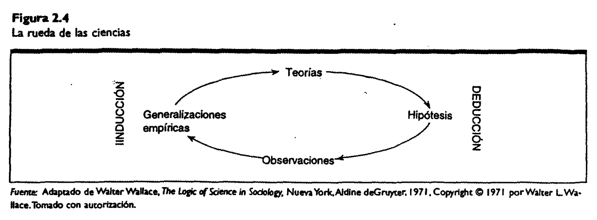
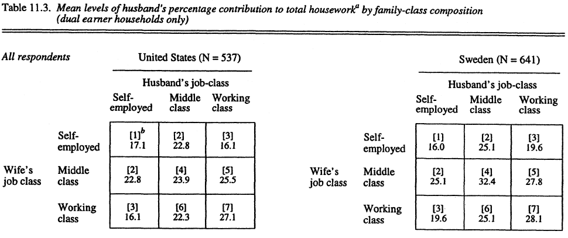
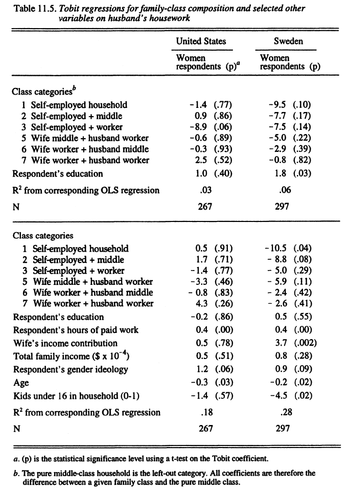
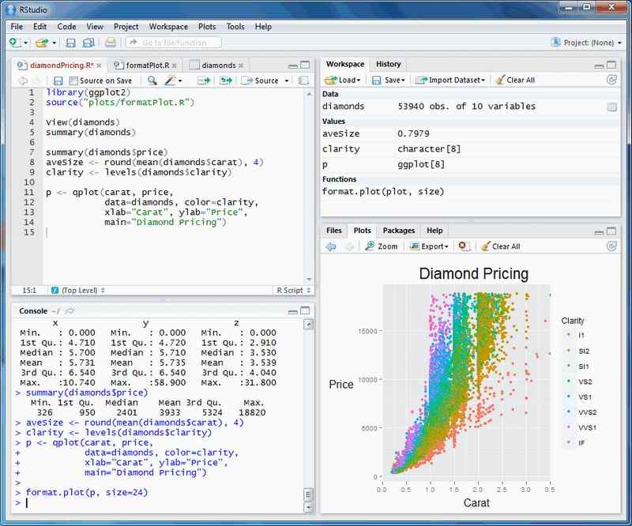

## Objetivos de la Sesión de Hoy {.smaller background-color="white"}

-   **Repasar** los conceptos de lógica inductiva y deductiva.
-   **Comprender** por qué los datos sistemáticos son superiores a las anécdotas para el análisis social.
-   **Reconocer** la variación como un elemento central de la realidad social y la estadística como su lenguaje.
-   **Argumentar** la relevancia de los lenguajes de programación (como R) para el análisis sociológico moderno.
-   **Analizar** un ejemplo de investigación sociológica real, identificando sus componentes.


---
title_slide_background: "#008080"
---

# 1. Del Hecho Social al Dato Estadístico

## Repaso de la Clase Anterior {.smaller background-color="white"}

En nuestra primera sesión establecimos las bases de la investigación social:

1.  **Conocimiento como Proceso:** La ciencia avanza en un ciclo entre la **teoría (deducción)** y la **observación (inducción)**.
2.  **Reflexividad:** Como sociólogos/as, somos **sujetos situados**. Nuestro rol no es ser neutrales, sino ser conscientes de cómo nuestra posición social influye en nuestra investigación.
3.  **El Hecho Social (Durkheim):** La sociología estudia patrones colectivos, externos al individuo, que pueden ser tratados "como cosas" y analizados empíricamente.
4.  **Cuantificación como Teoría:** Medir es un acto teórico. Implica decidir qué es importante y cómo representarlo numéricamente, siguiendo una lógica y niveles de medición.

Hoy, profundizaremos en la lógica detrás de esa cuantificación: el **razonamiento estadístico**.


---
title_slide_background: "#008080"
---

# 2. Datos contra Anécdotas: El Razonamiento Estadístico

## Repaso Rápido: La Rueda de la Ciencia {.smaller background-color="white"}

Recordemos el ciclo de la investigación social: un diálogo constante entre el mundo de las ideas (**Teoría**) y el mundo de lo observable (**Datos**).

{fig-align="center" width="700"}


-   **Deducción:** Parte de la teoría para generar hipótesis que se ponen a prueba con datos.
-   **Inducción:** Parte de los datos para encontrar patrones y construir teoría.

La estadística nos proporciona las herramientas para navegar este ciclo de forma rigurosa.

## Los Datos Tienen Contexto {.smaller background-color="white"}

"La estadística trata sobre datos. Éstos son números, pero no sólo son eso. Los datos son números en un contexto."
— David S. Moore (2005)

El número **`3.75`** por sí solo no significa nada.
-   Si es el peso de un bebé en **kilos**, es una excelente noticia.
-   Si es el peso de un bebé en **gramos**, es una tragedia.

En sociología, el contexto es todo. La estadística nos ayuda a interpretar números dentro de un marco social significativo. Un 10% de desempleo no es solo un número; representa vidas, políticas y estructuras sociales.

## Datos Sistemáticos vs. Anécdotas {.smaller background-color="white"}

-   **Anécdota:** Una historia sorprendente y memorable. Humaniza un tema, pero puede ser engañosa porque a menudo representa un caso extremo o atípico.
    -   *Ejemplo sociológico: "Mi abuelo fumó toda su vida y murió a los 98 años, así que fumar no es tan malo".*
-   **Datos Sistemáticos:** Recopilación planificada y exhaustiva de información que busca representar una realidad más amplia.
    -   *Ejemplo sociológico: Datos de salud pública que muestran que, en promedio, los fumadores tienen una esperanza de vida significativamente menor.*

La ciencia social se basa en datos sistemáticos porque las anécdotas, aunque poderosas, son una forma de **observación selectiva**.

## El Caso de Ann Landers: ¿Por qué los datos importan? {.smaller background-color="white"}

En 1976, la columnista Ann Landers preguntó a sus lectoras: *"Si pudieran volver a hacerlo, ¿tendrían hijos?"*.

-   **El Resultado (Anécdotas a gran escala):** Recibió casi 10.000 respuestas. El 70% dijo **NO**. El titular fue explosivo: "El 70% de los padres se arrepienten de tener hijos".
-   **El Problema:** ¿Quiénes se molestaron en escribir una carta? Aquellos con una opinión fuerte y probablemente negativa. Esto es un **sesgo de autoselección**. No es una muestra representativa.
-   **El Contraste (Datos Sistemáticos):** Una encuesta nacional posterior, con una muestra representativa, encontró que el **91%** de los padres **SÍ** volverían a tener hijos.

**Lección:** El método de recolección de datos determina la validez de nuestras conclusiones.

::: footer
Fuente: Caso citado en Moore, D. S. (2005).
:::

## La Variación está Siempre Presente {.smaller background-color="white"}

-   La realidad social no es homogénea ni determinista. Las personas, los grupos y los contextos **varían**.
-   Los ingresos varían, las opiniones varían, los resultados de una política varían.
-   La estadística es el **lenguaje de la variación**. Nos permite:
    1.  **Describir** la variación (¿cuán dispersas están las opiniones?).
    2.  **Identificar** fuentes de variación (¿por qué varían los ingresos? ¿Por género, educación?).
    3.  **Manejar la incertidumbre** que la variación genera.

Como la variación es omnipresente, en las ciencias sociales no existen "verdades absolutas", sino conclusiones con un cierto grado de probabilidad o confianza.

## John Goldthrope {.smaller background-color="white"}

:::::: columns
:::: {.column width="50%"}  

Goldthorpe (1935) es un sociólogo británico conocido principalmente por su trabajo en estratificación, movilidad social y educación.

En las etapas avanzadas de su carrera desarrolló una programa específico sobre lo que debe ser la sociología caracterizado por el individualismo metodológico, la teoría de la acción racional y la sociología analítica.   

Esto se desarrolla principalmente en sus libros “De la Sociología” y especialmente “La Sociología como Ciencia de la Población”.  
::::
:::: {.column width="50%"}


{fig-align="center" width="400"}

::::
::::::


## La Sociología como Ciencia de la Población (2015)  {.smaller background-color="white"}


En este libro Goldthorpe plantea que la tarea fundamental de la sociología es explicar las regularidades de la población, la variabilidad que se produce a nivel individual.    

Dada dicha variabilidad y por la autonomía que retiene la acción individual aún ante la existencia de condicionamientos socioculturales, la acción individual debe tener una primacía explicativa (cf. Weber y Durkheim).

Dado el énfasis en la acción individual, la estadística juega un rol fundamental para medir y analizar regularidades poblacionales (en conjunción con objetos
sociológicos).  

El objetivo explicativo de la sociología es dar cuenta de los mecanismos (individuales) que permiten generara las regularidades observadas en la población.

---
title_slide_background: "#008080"
---

# 2. La Estadística en Acción: Un Caso de Estudio

## El Caso: Clase, Género y Trabajo Doméstico {.smaller background-color="white"}

**Estudio:** "The noneffects of class on the gendered division of labor in the home" (Los no-efectos de la clase en la división de género del trabajo en el hogar).
**Autor:** Erik Olin Wright y Janeen Baxter (1997).

-   **Objetivo Central:** Explorar sistemáticamente la relación empírica entre la **posición de clase** de los hogares y la **desigualdad de género** en la realización del trabajo doméstico.
-   **Contexto Teórico:** El debate clásico entre el marxismo y el feminismo sobre si la estructura de clases capitalista es la causa fundamental de la subordinación de las mujeres en la esfera privada.

## El Vacío en la Investigación {.smaller background-color="white"}

Wright parte identificando un problema en la sociología de su época:

-   A pesar de la intensa discusión teórica, existía **muy poca investigación cuantitativa sistemática** sobre el tema.
-   **Los marxistas** tendían a analizar la relación a un nivel macro-abstracto ("capitalismo vs. patriarcado").
-   **Las feministas** a menudo se centraban en procesos micro-cualitativos y, como los marxistas, solían ser "hostiles a la investigación cuantitativa".
-   Los estudios cuantitativos sobre trabajo doméstico solían ignorar la clase como un eje central de análisis.

El estudio de Wright busca llenar este vacío, testeando empíricamente las grandes teorías.

## Expectativas Teóricas: 5 Hipótesis en Competencia {.smaller background-color="white"}

Wright no parte de cero. Revisa la literatura y extrae cinco grandes hipótesis, provenientes de distintas tradiciones teóricas, que explican por qué la división del trabajo doméstico podría variar según la clase social.

Vamos a revisarlas una por una.

## Hipótesis 1 y 2: La Perspectiva Marxista Clásica {.smaller background-color="white"}
::: {style="font-size: 0.9em; line-height: 1.2;"}

Basadas en el argumento de Friedrich Engels sobre la propiedad privada como raíz de la dominación masculina.

-   **Hipótesis 1: Igualitarismo de la Clase Obrera.**
    -   *Lógica:* En los hogares proletarios, al no haber propiedad que heredar, desaparece la base material para la dominación masculina. La incorporación de la mujer al trabajo asalariado refuerza esta tendencia.
    -   *Predicción:* Mientras más proletarizado sea un hogar, más igualitaria será la división del trabajo doméstico.

-   **Hipótesis 2: Desigualdad de la Pequeña Burguesía.**
    -   *Lógica:* En los hogares donde la propiedad de los medios de producción sigue siendo central (autoempleados, pequeños empresarios), se mantendrán las lógicas patriarcales tradicionales.
    -   *Predicción:* Los hogares de pequeña burguesía homogénea serán los más desiguales.
    
::: 


## Hipótesis 3: La Perspectiva de las Culturas de Clase {.smaller background-color="white"}

Esta hipótesis se basa en la idea de que las experiencias laborales moldean valores y actitudes.

-   **Hipótesis 3: Culturas de Clase y Sexismo.**
    -   *Lógica:* El trabajo manual de la clase obrera, que valora la fuerza física y la solidaridad masculina, fomentaría una masculinidad más tradicional y sexista. En contraste, los trabajos de clase media, con mayor "complejidad cognitiva" (Kohn, 1969), promoverían actitudes más flexibles y abiertas hacia los roles de género.
    -   *Predicción:* Los hombres de clase obrera harán proporcionalmente menos trabajo doméstico. Los hogares de clase media homogénea serán los más igualitarios.

## Hipótesis 4: La Perspectiva del Poder de Negociación {.smaller background-color="white"}

Esta visión entiende el hogar como un espacio de conflicto y negociación, no solo de roles socializados.

-   **Hipótesis 4: Poder de Negociación de Clase.**
    -   *Lógica:* El poder de negociación de cada cónyuge depende de los recursos (económicos, de estatus) que aporta. Una mujer en una posición de clase más alta que su marido tendrá más poder para negociar una división más justa.
    -   *Predicción:* Los hogares con una esposa de clase media y un esposo de clase trabajadora serán los más igualitarios.

## Hipótesis 5: La Perspectiva de la Autonomía del Género {.smaller background-color="white"}

Desde una tesis feminista central, esta hipótesis cuestiona la primacía de la clase.

-   **Hipótesis 5: Autonomía del Género.**
    -   *Lógica:* Las relaciones de género son un sistema de poder con una autonomía real. No son un simple reflejo de la estructura de clases. La división del trabajo doméstico se explica principalmente por las dinámicas y luchas de género en sí mismas, no por la clase.
    -   *Predicción:* El grado de igualdad en el trabajo doméstico **no variará mucho** entre hogares de distinta composición de clase. Los efectos de clase, si existen, serán débiles.

## Diseño Metodológico {.smaller background-color="white"}

-   **Datos:** Encuestas de hogares de doble ingreso en **Estados Unidos** y **Suecia**.
-   **Comparación Clave:** Se eligen estos países porque representan "polos opuestos" en términos de desigualdad económica y de género. Suecia, con su robusto estado de bienestar, debería mostrar patrones más igualitarios.
-   **Variable Dependiente:** Porcentaje de contribución del esposo al trabajo doméstico total (reportado por las esposas, considerado más fiable).
-   **Variable Independiente Principal:** Composición de clase de la familia (una matriz que combina la clase del esposo y la esposa en 7 categorías, ej. "Hogar de clase media pura", "Esposa de clase media, esposo de clase obrera", etc.).

## Primeros Resultados: ¿Qué nos dicen los datos? {.smaller background-color="white"}

{fig-align="center"}

## Discusión 1: Interpretando las Medias {.smaller background-color="white"}

**Observando la tabla, en grupos, discutan:**

1.  ¿En qué tipo de hogar (composición de clase) los maridos parecen aportar **más** al trabajo doméstico? ¿Y en cuál **menos**?
2.  ¿Se observan diferencias importantes entre Estados Unidos y Suecia? ¿Dónde son más grandes las brechas?
3.  A primera vista, ¿cuál de las 5 hipótesis parece recibir más apoyo de estos datos? ¿Cuál parece ser la más débil?

## Interpretación de Wright (Resultados Descriptivos) {.smaller background-color="white"}

-   **Las diferencias de clase son modestas:** En general, la variación entre las distintas composiciones de clase no es muy grande, especialmente en EE.UU.
-   **El "Efecto Suecia":** Las diferencias de clase son algo mayores en Suecia. La gran diferencia entre los países se da en los hogares de **clase media pura**, donde los maridos suecos aportan casi 10 puntos porcentuales más que los estadounidenses.
-   **El "Efecto Pequeña Burguesía":** En ambos países, los maridos en hogares con al menos un miembro autoempleado tienden a hacer **significativamente menos** trabajo doméstico, apoyando la idea de un "patriarcado más tradicional" en este grupo (apoyo parcial a H2).

## Añadiendo Controles: ¿Se mantiene el efecto de clase? {.smaller background-color="white"}

:::::: columns
:::: {.column width="30%"}  

El siguiente paso es usar un modelo de regresión para ver si los efectos de clase persisten cuando controlamos por otras variables importantes (educación, edad, horas de trabajo de la esposa, ideología de género, etc.).
  
::::
:::: {.column width="70%"}


{fig-align="center" width="400"}

::::
::::::

## Discusión 2: Interpretando la Regresión {.smaller background-color="white"}

**Observando los resultados del modelo multivariado:**

1.  Cuando se añaden los controles, ¿los coeficientes de las categorías de clase siguen siendo significativos? ¿Qué sucede con la diferencia entre la clase media y la clase obrera en Suecia?
2.  ¿Qué variable parece ser ahora la más importante para explicar la contribución del marido al trabajo doméstico?
3.  ¿Cómo cambia esto nuestra interpretación inicial? ¿El efecto de la clase era real o era un "espejismo" causado por otras variables (como la educación o la edad)?

## Interpretación de Wright (Resultados Multivariados) {.smaller background-color="white"}

-   **El efecto de clase se desvanece:** Una vez que se introducen los controles, casi todas las diferencias de clase estadísticamente significativas desaparecen, especialmente en EE.UU. En Suecia, el efecto de clase se reduce drásticamente y se vuelve no significativo, sugiriendo que estaba mediado principalmente por la educación y la edad (efectos de cohorte).
-   **Nuevos protagonistas:** Las variables más potentes para explicar la división del trabajo son:
    1.  **Las horas de trabajo remunerado de la esposa:** Cuanto más trabaja la esposa, más hace el esposo (el predictor más fuerte).
    2.  **La contribución de la esposa al ingreso familiar** (significativo en Suecia).
    3.  **La ideología de género** (con un efecto modesto pero significativo).

## Conclusiones e Implicaciones del Estudio {.smaller background-color="white"}

-   **El Hallazgo Central:** La posición en la estructura de clases **no es un determinante poderoso** de las variaciones en la división del trabajo doméstico a nivel de los hogares.
-   **¿Qué hipótesis se confirma?** Los resultados son más consistentes con la **Hipótesis 5 (Autonomía del Género)**. Las dinámicas de género (poder de negociación basado en recursos económicos, ideología) parecen ser mucho más importantes que la clase social *per se*.
-   **Rechazo de las otras hipótesis:** Los datos no apoyan el "igualitarismo de clase obrera" (H1), la idea de "culturas de clase" sexistas (H3), ni el poder de negociación basado en la asimetría de clase entre cónyuges (H4). La H2 (desigualdad pequeño-burguesa) recibe un apoyo limitado y localizado.
-   **Una Reflexión Final:** Quizás la clase no opera a nivel micro (entre hogares), sino a nivel **macro-institucional**. La política de clases en Suecia creó un Estado de Bienestar que, a su vez, facilitó un mayor igualitarismo de género. La clase importa, pero de una forma más indirecta y estructural de lo que las hipótesis originales suponían.

---
title_slide_background: "#008080"
---

# 3. ¿Por qué Aprender a Programar? La Estadística en el Siglo XXI

## La Evolución del Análisis de Datos en Sociología {.smaller background-color="white"}

:::::: columns
:::: {.column width="50%"}
**El Pasado**

-   Cálculos manuales.
-   Tabuladoras mecánicas.
-   Software de "point-and-click" (ej. SPSS), donde el análisis se oculta detrás de menús.

**Limitaciones:**  
-   Poca transparencia.  
-   Difícil de replicar.  
-   Limitado a las opciones del menú.  
::::
:::: {.column width="50%"}
**El Presente y Futuro**

-   Grandes volúmenes de datos (Big Data).  
-   Nuevas fuentes: redes sociales, textos, datos geoespaciales.  
-   Necesidad de herramientas **transparentes, flexibles y potentes**.  

**La Solución:**  
-   Lenguajes de programación orientados a datos.
::::
::::::

## Ventajas de Usar un Lenguaje de Programación (como R) {.smaller background-color="white"}

1.  **Transparencia y Reproducibilidad:**
    -   Un *script* de código es una receta exacta de cada paso de tu análisis. Cualquier persona (incluido tu "yo" del futuro) puede ejecutarlo y obtener exactamente los mismos resultados. **Este es el pilar de la ciencia abierta.**
2.  **Flexibilidad y Potencia:**
    -   No estás limitado por un menú. Tienes acceso a miles de paquetes con las técnicas estadísticas más avanzadas, a menudo desarrolladas por los mismos académicos que las crearon.


## Ventajas de Usar un Lenguaje de Programación (como R) {.smaller background-color="white"}
    

3.  **Visualización de Datos Superior:**
    -   Permite crear gráficos de alta calidad, personalizados y listos para publicar (ej. con el paquete `ggplot2`), superando con creces las opciones estándar de otros programas.
4.  **Automatización y Eficiencia:**
    -   Facilita el manejo de tareas complejas y repetitivas, ahorrando tiempo y reduciendo errores.

**En resumen: Te da el control total sobre tu análisis.**

## Presentación de R y RStudio {.smaller background-color="white"}

:::::: columns
:::: {.column width="50%"}
-   **R:** Es el **lenguaje de programación** y el motor estadístico. Es potente, pero su uso directo en la "consola" es poco amigable.

-   **RStudio:** Es un **Entorno de Desarrollo Integrado (IDE)**. Es una interfaz gráfica que hace que trabajar con R sea mucho más fácil e intuitivo. **Usaremos R *a través* de RStudio.**
::::
:::: {.column width="50%"}
{fig-align="center"}
::::
::::::

**La primera ayudantía de esta semana se centrará en la instalación y los primeros pasos en este entorno.**

---
title_slide_background: "#008080"
---

## La Lógica de R: Objetos y Funciones {.smaller background-color="white"}

::: {style="font-size: 0.9em; line-height: 1.2;"}

Para empezar a pensar en R, necesitamos entender dos ideas clave. R opera con una lógica simple: **creamos "objetos" y luego les aplicamos "funciones" para que hagan algo.**

:::::: columns
::: {.column width="50%"}
**1. Objetos: Los Contenedores de Información**

-   Un **objeto** es simplemente un nombre al que le asignamos algo. Piénsalo como una caja con una etiqueta.
-   Usamos el operador de asignación `<-` para "guardar" información en un objeto.
-   Estos objetos pueden contener cualquier cosa: un solo número, una columna de datos (vector), una base de datos completa (data frame), un gráfico, etc.

**Todo en R es un objeto.**
:::
::: {.column width="50%"}
**2. Funciones: Los Verbos de R**

-   Una **función** es una acción que realiza una tarea específica sobre un objeto.
-   Tienen un nombre seguido de paréntesis `()`. Dentro de los paréntesis van los "argumentos", que son los insumos que la función necesita.
-   La estructura es siempre: `nombre_funcion(argumento1, argumento2, ...)`

**Las funciones HACEN cosas con los objetos.**
:::
::::::

:::
## La Lógica de R: Objetos y Funciones {.smaller background-color="white"}

```{r, eval=T, echo=TRUE}
# EJEMPLO PRÁCTICO:

# 1. Creamos un objeto llamado 'edades' que contiene un vector de números.
#    Usamos la función c() que significa "concatenar" o "combinar".
edades <- c(25, 30, 22, 45, 38)

# 2. Ahora aplicamos funciones al objeto 'edades'.

# La función mean() calcula el promedio del objeto que le damos como argumento.
mean(edades)

# La función summary() nos da un resumen estadístico del objeto.
summary(edades)
```

## Cierre de la Unidad: La Estadística como Práctica Sociológica {.smaller background-color="white"}

-   **Vimos que la estadística** no es solo un conjunto de técnicas matemáticas, sino una herramienta fundamental para **hacer visible lo social**. Nos permite pasar de la anécdota al análisis de **hechos sociales** (Durkheim) y **regularidades poblacionales** (Goldthorpe).

-   **Aprendimos que cuantificar es un acto teórico y reflexivo**. Al medir, tomamos decisiones sobre qué es importante, y debemos ser conscientes de cómo nuestra posición como investigadores/as influye en ese proceso.

-   **Analizamos cómo la visualización de datos** puede contar historias sociológicas complejas sobre la estructura social (Bourdieu), el cambio histórico (Piketty) y las relaciones entre clase y género (Wright).

**¡Ahora a la práctica!**

-   En la **primera ayudantía de R** esta semana, comenzarán a construir su propia caja de herramientas. Aprenderán a crear objetos y usar funciones para empezar a explorar datos.

**Adelanto de la Unidad 2:** "Conceptos claves para la investigación social: Conceptualización, Operacionalización y Medición".
