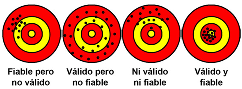
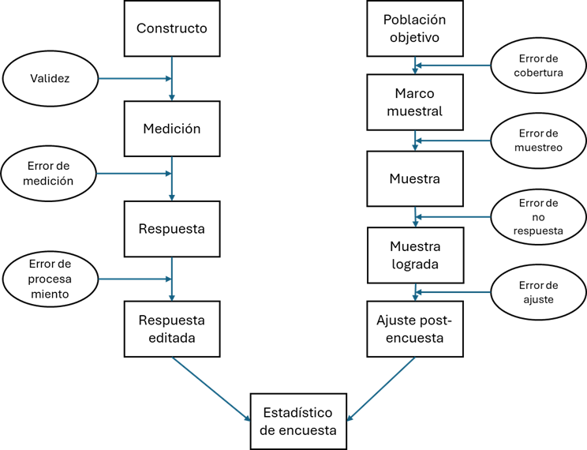

## Objetivos de la Sesión de Hoy {.smaller background-color="white"}

-   **Distinguir** entre población y muestra, y comprender la lógica del muestreo probabilístico.
-   **Identificar** los conceptos de población objetivo y marco muestral, y reconocer sus desafíos prácticos.
-   **Comparar** diferentes diseños de muestreo probabilístico (MAS, sistemático, estratificado, conglomerados).
-   **Analizar** ejemplos de marcos y diseños muestrales utilizados en encuestas chilenas reales.
-   **Evaluar** la calidad de una medición a través de los criterios de **fiabilidad** y **validez**.

---
title_slide_background: "#008080"
---

# 1. ¿A quiénes estudiamos? La Lógica del Muestreo

## Repaso: De la Idea al Dato {.smaller background-color="white"}

En la clase anterior, establecimos el camino para medir un concepto sociológico:

1.  **Conceptualización:** Definir con precisión teórica qué queremos decir (ej. ¿qué es "clase social"?).
2.  **Operacionalización:** Decidir cómo lo vamos a medir empíricamente (ej. a través de indicadores de capital económico, social y cultural).
3.  **Unidad de Análisis:** Determinar sobre quién o qué sacaremos conclusiones (ej. individuos en un contexto familiar).
4.  **Nivel de Medición:** Elegir la escala adecuada para nuestras variables (nominal, ordinal, etc.).

Hoy, respondemos a la siguiente pregunta: una vez que sabemos qué medir y en quiénes, **¿cómo seleccionamos a las unidades de análisis que efectivamente vamos a estudiar?**

## ¿Por qué Muestrear? Población vs. Muestra {.smaller background-color="white"}

:::::: columns
::: {.column width="65%"}
**Población (o Universo)**  
-   Es el **conjunto completo** de todas las unidades de análisis sobre las que queremos hacer afirmaciones (ej. *todos* los estudiantes de pregrado en Chile).    
-   Estudiar a toda la población se llama **Censo**. Es extremadamente costoso, lento y a menudo impracticable.    

**Muestra**  
-   Es un **subconjunto** de la población que seleccionamos para estudiar.    
-   El objetivo es usar la información de la muestra para hacer **inferencias** (generalizaciones) sobre la población total.    
:::
::: {.column width="35%"}
{fig-align="center"}
:::
::::::

## La Lógica del Muestreo Probabilístico {.smaller background-color="white"}

El **muestreo probabilístico** es el pilar de la investigación cuantitativa que busca generalizar. Su lógica se basa en un principio fundamental:

La selección **aleatoria** (al azar).

-   **Principio Clave:** Cada unidad de la población tiene una probabilidad **conocida y no nula** de ser seleccionada para la muestra.
-   **Ventajas Fundamentales:**
    1.  **Minimiza el sesgo de selección:** El azar, no la conveniencia ni las preferencias del investigador, decide quién entra en la muestra. Una muestra probabilística bien diseñada es, por definición, **representativa**.
    2.  **Permite estimar el error muestral:** Nos da acceso a la teoría de la probabilidad, que nos permite calcular con precisión qué tan lejos están probablemente nuestras estimaciones del verdadero valor en la población.

## Población Objetivo vs. Marco Muestral {.smaller background-color="white"}

Aquí es donde la teoría se encuentra con la realidad.

-   **Población Objetivo:** Es la definición **teórica** y abstracta del grupo que queremos estudiar.
    -   *Ejemplo:* "Todos los hogares que residen en viviendas particulares en Chile en 2022".

-   **Marco Muestral:** Es la **lista o dispositivo concreto** del cual extraemos la muestra. Es la **operacionalización** de la población.
    -   *Ejemplo:* Un listado de todas las viviendas del país, un directorio telefónico, un registro de nacimientos.

**El problema fundamental:** El marco muestral casi nunca es una representación perfecta de la población objetivo. Esta brecha puede ser una importante fuente de error.

## Ejemplo 1: Encuesta CASEN {.smaller background-color="white"}

-   **Población Objetivo:** "Hogares que habitan viviendas particulares ocupadas y sus residentes habituales" a nivel nacional.
-   **Marco Muestral:** El Marco Muestral de Viviendas (MMV) del INE, que se construye a partir del Censo y se actualiza periódicamente. Es una lista de "unidades primarias de muestreo" (UPM), que son áreas geográficas (similares a manzanas).
-   **Ventajas del Marco:** Alta cobertura y calidad, es el mejor marco de viviendas disponible en el país.
-   **Desafíos y Sesgos Potenciales:**
    -   **Problema de Cobertura:** El marco **excluye** comunas y UPMs clasificadas como "áreas especiales" de difícil acceso (ej. Ollagüe, Isla de Pascua, Antártica Chilena).
    -   **Problema de Actualización:** No captura instantáneamente las viviendas nuevas o las que han sido demolidas desde la última actualización.
    -   **Consecuencia:** Las personas que viven en estas zonas excluidas tienen una probabilidad de selección igual a cero, lo que introduce un **sesgo de cobertura**.

## Ejemplo 2: Encuesta CADEM Plaza Pública {.smaller background-color="white"}

-   **Población Objetivo:** "Hombres y mujeres de 18 años o más, habitantes en las 16 regiones del país".
-   **Marco Muestral:** Una base de datos propia con más de 18 millones de números de celulares, generada a través de *Random Digit Dialing* (RDD).
-   **Ventajas del Marco:** Rapidez, bajo costo y alta penetración de la telefonía móvil en Chile.
-   **Desafíos y Sesgos Potenciales:**
    -   **Problema de Cobertura:** Excluye sistemáticamente a la población que **no tiene celular**, que suele ser de mayor edad y menor nivel socioeconómico.
    -   **Sesgo de No Respuesta:** El desafío más grande. La tasa de logro es baja (cerca del 11%). Quienes deciden contestar una encuesta de un número desconocido pueden ser sistemáticamente diferentes (ej. más interesados en política, más confiados) de quienes no contestan. Esto es un **sesgo de autoselección**.

## Ejemplo 3: Encuesta Longitudinal de Primera Infancia (ELPI) {.smaller background-color="white"}

-   **Población Objetivo:** "Niños y niñas nacidos en Chile entre el 1 de enero de 2006 y el 31 de diciembre de 2016".
-   **Marco Muestral:** Las partidas de nacimiento del **Servicio de Registro Civil e Identificación (SRCeI)**.
-   **Ventajas del Marco:** Es un marco de **altísima calidad**. Es prácticamente un censo de todos los nacimientos, lo que lo hace casi perfecto para esta población específica. Permite seguir a las mismas personas a lo largo del tiempo (diseño longitudinal).
-   **Desafíos y Sesgos Potenciales:**
    -   **Limitación:** Solo sirve para esa población específica. No es útil para estudios sobre la población general.
    -   **Atrición:** En estudios longitudinales, el principal desafío es la "mortalidad muestral" o atrición: la pérdida de participantes a lo largo del tiempo, que puede no ser aleatoria.

---
title_slide_background: "#008080"
---

# 2. Diseños de Muestreo Probabilístico

## El Ideal: Muestreo Aleatorio Simple (MAS) {.smaller background-color="white"}

-   **Definición:** Cada elemento de la población tiene exactamente la misma probabilidad de ser seleccionado. Es el equivalente a poner todos los nombres en un sombrero y sacar uno por uno.
-   **Requisito:** Necesita una **lista completa y numerada** de todos los elementos de la población (un marco muestral perfecto).
-   **Método:** Se usa una tabla de números aleatorios o un software para seleccionar los números de la lista.

## ¿Por qué el Muestreo Aleatorio Simple es tan raro en la práctica? {.smaller background-color="white"}

Aunque es el modelo base de la estadística, el MAS casi nunca se usa en encuestas sociales a gran escala por tres razones fundamentales:

1.  **Prerrequisito casi imposible:** Rara vez tenemos un **marco muestral completo y actualizado** de la población objetivo (ej. no existe una lista única de "todos los habitantes de Santiago").
2.  **Ineficiencia y Costo:** Incluso si tuviéramos la lista, una muestra MAS para una encuesta cara a cara sería logísticamente muy compleja. Los seleccionados estarían dispersos por todo el país, desde Arica hasta Punta Arenas, haciendo el trabajo de campo inviable.
3.  **No garantiza la representatividad de subgrupos:** Por puro azar, una muestra MAS podría seleccionar muy pocos individuos de un subgrupo pequeño pero importante (ej. una etnia minoritaria), impidiendo hacer análisis sobre ellos.

Por estas razones, se han desarrollado diseños más complejos y eficientes.

## Solución Práctica 1: Muestreo Estratificado {.smaller background-color="white"}

-   **Lógica:** En lugar de muestrear de la población total, primero la dividimos en subgrupos homogéneos y mutuamente excluyentes llamados **estratos**. Luego, se realiza un muestreo aleatorio *dentro* de cada estrato.
-   **Objetivo Principal:** Asegurar la **representatividad de subgrupos clave** y aumentar la precisión estadística.
-   **Ejemplo (CADEM):** La población se estratifica por **Región**. Esto garantiza que cada región del país esté representada en la muestra en la proporción correcta, algo que el MAS no podría asegurar.
 

## Solución Práctica 2: Muestreo por Conglomerados {.smaller background-color="white"}

-   **Lógica:** Muestrear grupos en lugar de individuos. La población se divide en grupos o **conglomerados** (generalmente geográficos). Se toma una muestra aleatoria de conglomerados y luego se estudian **todas o algunas** de las unidades dentro de los conglomerados seleccionados.
-   **Objetivo Principal:** **Eficiencia logística y reducción de costos**, especialmente en encuestas presenciales.
-   **Ejemplo (CASEN - Primera Etapa):** En lugar de seleccionar hogares al azar en todo Chile, primero se selecciona una muestra de **conglomerados** (las "manzanas" o UPMs). El trabajo de campo se concentra solo en esas áreas.
-   **Trade-off:** Es más barato, pero estadísticamente menos preciso que el MAS o el estratificado, porque las personas dentro de un conglomerado tienden a parecerse entre sí (homogeneidad intraconglomerado).

## Poniendo todo junto: Diseños Muestrales Complejos (Multietápicos) {.smaller background-color="white"}

Las encuestas reales como CASEN combinan estas técnicas en un **diseño muestral complejo y multietápico**.

El diseño de CASEN es **probabilístico, estratificado y bietápico**:

1.  **Estratificación:** La población de viviendas se divide en estratos según Comuna, Área (urbana/rural) y Nivel Socioeconómico.
2.  **Primera Etapa (Muestreo de Conglomerados):** Dentro de cada estrato, se selecciona aleatoriamente un número de **conglomerados** (UPMs o "manzanas").
3.  **Segunda Etapa (Muestreo de Unidades Finales):** Dentro de cada conglomerado seleccionado, se realiza un listado de las viviendas y se selecciona una muestra aleatoria de **viviendas** para ser encuestadas.

Este diseño equilibra la representatividad (gracias a la estratificación) con la eficiencia logística (gracias al muestreo por conglomerados).

---
title_slide_background: "#008080"
---

# 3. La Calidad de la Medición y el Error Total

## De la Selección a la Calidad {.smaller background-color="white"}

Ya hemos resuelto el problema de **a quiénes** estudiar a través de la lógica del muestreo. Ahora, enfrentamos una pregunta igualmente importante:

**¿Qué tan bien estamos midiendo lo que queremos estudiar?**

La calidad de nuestros datos no solo depende de una buena muestra, sino también de la calidad de nuestros instrumentos de medición. Esto nos introduce a dos conceptos fundamentales: **fiabilidad** y **validez**.

## Fiabilidad: ¿Es consistente nuestra medición? {.smaller background-color="white"}

La **fiabilidad** (o confiabilidad) se refiere a la **consistencia** y **estabilidad** de una medición. Si aplicamos el mismo instrumento repetidamente al mismo objeto bajo las mismas condiciones, ¿obtenemos siempre el mismo resultado?

-   Una medida poco fiable es impredecible y errática.  
-   Se asocia con el **error aleatorio**: fluctuaciones que no tienen un patrón definido.  

**En sociología, la falta de fiabilidad puede ocurrir si:**.    
-   Las preguntas de una encuesta son ambiguas y cada persona las interpreta de forma distinta en momentos distintos.  
-   Los observadores que codifican un comportamiento usan criterios que cambian con el tiempo o entre ellos.

## Validez: ¿Medimos lo que realmente queremos medir? {.smaller background-color="white"}

La **validez** se refiere al grado en que una medida empírica refleja adecuadamente el **significado real del concepto** que pretende medir. Es una pregunta sobre la **exactitud conceptual**.

-   Una medida no válida puede ser muy consistente, pero está midiendo sistemáticamente otra cosa.  
-   Se asocia con el **error sistemático (sesgo)**: un error que consistentemente desvía la medición en una misma dirección.  

**En sociología, la falta de validez es un riesgo constante porque:**.   
-   Nuestros conceptos son abstractos (ej. "anomia", "capital social").    
-   Las personas pueden dar respuestas socialmente deseables en lugar de honestas.    
-   Nuestros indicadores pueden ser una simplificación excesiva del concepto.   

## Tres Tipos de Validez: ¿Cómo evaluamos la exactitud? {.smaller background-color="white"}

La validez no es un concepto único. En la práctica, la evaluamos de diferentes maneras, cada una respondiendo a una pregunta distinta sobre la calidad de nuestra medición.

**1. Validez de Contenido**

*Pregunta clave: ¿La medida cubre todas las facetas relevantes del concepto?*

Se enfoca en la **amplitud y representatividad** de los indicadores. Se evalúa teóricamente, a menudo con juicio de expertos.

**Ejemplo:** Una medida de "bienestar social" que solo incluye indicadores de ingreso económico tendría baja validez de contenido, pues omite dimensiones cruciales como la salud, las redes sociales o la seguridad.

## Tres Tipos de Validez: ¿Cómo evaluamos la exactitud? {.smaller background-color="white"}

**2. Validez de Criterio (o Predictiva)**

*Pregunta clave: ¿La medida se correlaciona con un resultado o comportamiento externo (criterio) que debería predecir?*

Se enfoca en la **utilidad práctica** de la medida.

**Ejemplo:** Una escala que mide el "riesgo de deserción escolar" tiene alta validez de criterio si los estudiantes con puntajes altos en la escala son, efectivamente, los que tienen más probabilidades de abandonar la escuela al año siguiente.

## Tres Tipos de Validez: ¿Cómo evaluamos la exactitud? {.smaller background-color="white"}

**3. Validez de Constructo**

*Pregunta clave: ¿La medida se comporta de la manera que la teoría sociológica predice que el concepto debería comportarse?*

Es la forma de validez más importante y abstracta.

**Ejemplo:** La teoría dice que el "capital social" se asocia positivamente con la "participación cívica". Si nuestra nueva escala de capital social muestra una fuerte correlación con una medida de participación cívica, es una evidencia a favor de su validez de constructo.

## La Analogía del Tiro al Blanco {.smaller background-color="white"}

Una forma clásica de entender la diferencia es con la analogía de un tirador:

{fig-align="center"}

-   **Fiable pero no Válido:** Todos los tiros dan en el mismo lugar, pero lejos del centro. La medición es consistente pero incorrecta.
-   **Válido pero no Fiable:** Los tiros están dispersos alrededor del centro. En promedio aciertan, pero la medición es inconsistente.
-   **Ni Fiable ni Válido:** Los tiros están dispersos y lejos del centro.
-   **Fiable y Válido (El Ideal):** Todos los tiros dan consistentemente en el centro.

## La Tensión entre Fiabilidad y Validez {.smaller background-color="white"}

En la práctica, a menudo existe una tensión entre ambos criterios.

Pensemos en medir el "estado de ánimo" de los trabajadores.

-   **Estrategia 1 (Alta Fiabilidad):** Contar el número de quejas formales presentadas al sindicato. Es un dato duro, consistente y fácil de replicar.  
-   **Estrategia 2 (Alta Validez Potencial):** Realizar una observación etnográfica en la fábrica, hablando con los trabajadores y capturando sus interacciones. Captura la riqueza y complejidad del "estado de ánimo".  

La primera medida es muy **fiable** pero de **validez cuestionable** (el estado de ánimo es más que la ausencia de quejas). La segunda es potencialmente muy **válida** pero **menos fiable** (depende de la interpretación del observador y es difícil de replicar).

El desafío del investigador es encontrar un equilibrio razonable.

## El Error Total de Encuesta: Un Marco Integrador {.smaller background-color="white"}

Nuestras conclusiones no solo dependen de a quiénes seleccionamos (muestreo), sino también de cómo medimos (calidad de la medición).

El **Error Total de Encuesta** es un marco que nos ayuda a pensar en todas las fuentes de imprecisión. Se compone de dos grandes tipos de error:

1.  **Error Muestral:** La diferencia entre un estadístico de la muestra y el parámetro de la población, que existe simplemente porque estudiamos una parte y no el todo. Es el error del **azar**, y es **estimable** en el muestreo probabilístico.

## El Error Total de Encuesta: Un Marco Integrador {.smaller background-color="white"}

2.  **Error No Muestral (o de Medición):** Todos los demás errores que pueden ocurrir en el proceso. Son **sesgos sistemáticos** y difíciles de cuantificar. Incluye:
    -   *Error de cobertura:* El marco muestral no cubre a toda la población.
    -   *Error de no respuesta:* Quienes no responden son distintos de quienes sí lo hacen.
    -   *Error del instrumento:* Preguntas mal formuladas o ambiguas.
    -   *Error del entrevistador:* El entrevistador influye en las respuestas.
    -   *Error de procesamiento:* Errores al digitar o codificar los datos.

----
## {.smaller background-color="white"}
{fig-align="center"}

## El Error Total como un Desafío de Diseño {.smaller background-color="white"}

El objetivo de un buen diseño de investigación es minimizar el **error total**.

**La Falacia de la Muestra Grande:**     
-   Creer que una muestra muy grande (bajo error muestral) puede compensar mediciones de mala calidad (alto error no muestral). **Esto es falso.**    
-   Si las preguntas de una encuesta son sesgadas, una muestra de un millón de personas solo nos dará una **respuesta equivocada con mucha precisión**.    
-   La calidad de la medición es tan importante, o incluso más, que el tamaño de la muestra.    

## Actividad de Aplicación (15 min) {.smaller background-color="white"}

**Escenario de Investigación:** Queremos realizar un estudio sobre el **"bienestar subjetivo de los estudiantes de la UDP"**.  

**En grupos, discutan:**  
1.  **Población y Marco Muestral:** ¿Cuál es la población objetivo? ¿Qué marco muestral usarían? ¿Qué sesgos de cobertura podría tener ese marco?    
2.  **Fiabilidad:** Si usan una pregunta como "¿Qué tan feliz es usted en una escala de 1 a 7?", ¿qué problemas de fiabilidad podrían surgir?  
3.  **Validez:** ¿La pregunta "¿Qué tan feliz es usted?" es una medida válida de "bienestar subjetivo"? ¿Qué otras dimensiones importantes del bienestar podría estar omitiendo?  
4.  **Error Total:** ¿Cuál creen que sería la mayor fuente de error en este estudio, el error muestral o el error no muestral? ¿Por qué?  

## Cierre de la Unidad 2 y Próximos Pasos {.smaller background-color="white"}
::: {style="font-size: 0.9em; line-height: 1.2;"}

-   Hemos desglosado el proceso fundamental de pasar de una idea abstracta a un dato medible, definiendo la **conceptualización**, la **operacionalización**, las **unidades de análisis** y los **niveles de medición**.  
-   Aprendimos la lógica detrás del **muestreo**: cómo y por qué seleccionamos un subconjunto de una población para estudiarla, y los desafíos prácticos de construir un buen **marco muestral**.
-   Diferenciamos los dos pilares de la calidad de la medición: **fiabilidad** (consistencia) y **validez** (exactitud conceptual).
-   Integramos los **errores de muestreo y de medición** en un marco de "Error Total", comprendiendo que un buen diseño de investigación debe minimizar ambos.

**Adelanto de la próxima clase:**  
-   Comenzaremos con la **Unidad 3: Marcos de datos para la investigación social**. Aprenderemos cómo se organizan estas mediciones en una base de datos y daremos nuestros primeros pasos para explorarlas con R.
::: 
