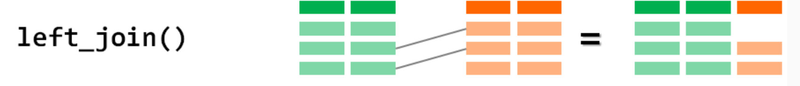
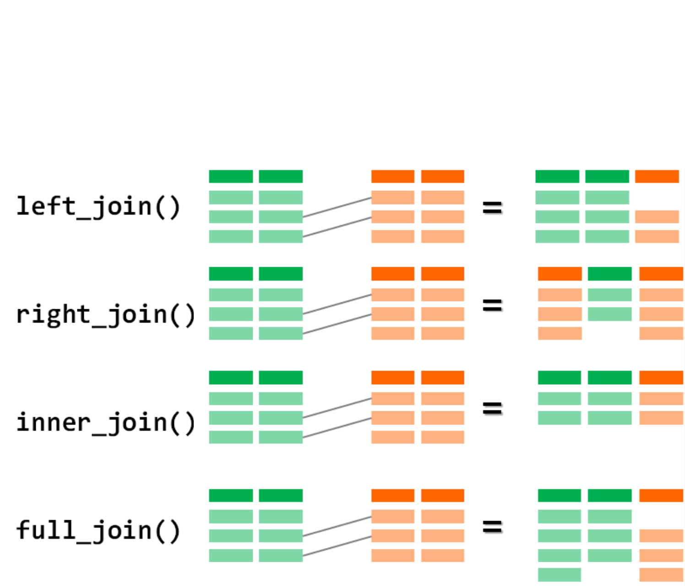

## Objetivos de la Sesión de Hoy {.smaller background-color="white"}

-   **Aprender** técnicas de recodificación de variables usando `case_when()`.
-   **Comprender y aplicar** la lógica de reestructurar datos de formato ancho a largo (`pivot_longer()`).
-   **Aprender** a combinar o cruzar dos tablas de datos diferentes usando `left_join()`.
-   **Distinguir** conceptualmente entre la construcción de índices y tipologías.

---
title_slide_background: "#008080"
---

# 1. Creando Variables con Lógica Condicional

## Repaso y Conexión {.smaller background-color="white"}

En la clase anterior, aprendimos la "gramática" de `dplyr` para manipular tablas:

-   **`select()`** para columnas.
-   **`filter()`** para filas.
-   **`arrange()`** para ordenar.
-   **`group_by()` + `summarise()`** para resúmenes por grupo.

Hoy nos enfocaremos en el verbo más creativo, **`mutate()`**, y en tareas más avanzadas: crear nuevas variables a partir de condiciones, cambiar la forma de nuestras tablas y unir diferentes bases de datos.

## Recodificación Condicional: `ifelse()` vs. `case_when()` {.smaller background-color="white"}

Para crear variables basadas en condiciones, tenemos dos herramientas principales:

:::::: columns
::: {.column width="50%"}  

**`ifelse()`**  
-   **Sintaxis:** `ifelse(condicion, valor_si_verdadero, valor_si_falso)`  
-   **Uso ideal:** Para recodificaciones **binarias** (dos resultados posibles).  
-   **Ejemplo:** Crear una variable "mayor de edad".  
```{r, eval=FALSE, echo=TRUE}
datos %>%
  mutate(mayor_edad = ifelse(edad >= 18, "Sí", "No"))
```
    
:::
::: {.column width="50%"}
**`case_when()`**  
-   **Sintaxis:** `case_when(condicion1 ~ valor1, condicion2 ~ valor2, ...)`  
-   **Uso ideal:** Para recodificaciones con **múltiples condiciones y resultados**. Es mucho más legible y seguro que anidar `ifelse()`.  
-   **Ejemplo:** Crear tramos de edad.  
```{r, eval=FALSE, echo=TRUE}
datos %>%
  mutate(tramo_edad = case_when(...))
```  
    
:::
::::::

## `case_when()` en Acción: Creando Tramos de Edad {.smaller background-color="white"}

`case_when()` se lee como una serie de instrucciones lógicas. R evalúa cada condición en orden y asigna el valor de la primera que sea `TRUE`.

**Sintaxis y Lógica:**
```{r, eval=FALSE, echo=TRUE}
casen %>%
  mutate(
    tramo_edad = case_when(
      edad <= 29              ~ "Joven (0-29)",
      edad >= 30 & edad <= 59 ~ "Adulto (30-59)",
      edad >= 60              ~ "Mayor (60+)",
      TRUE                    ~ "Dato perdido o sin edad" # Captura todo lo demás
    )
  )
```
-   La `~` (tilde) se lee como "entonces asigna este valor".
-   `&` significa que ambas condiciones deben ser verdaderas.
-   `TRUE ~ ...`: Esta última línea es una "catch-all" o cláusula por defecto. Si ninguna de las condiciones anteriores se cumple, se asignará este valor. Es una muy buena práctica incluirla siempre.

---
title_slide_background: "#008080"
---

# 2. Reestructurando Datos con `tidyr`

## El Problema de los Datos "Anchos" (Wide) {.smaller background-color="white"}

A veces, los datos no vienen en formato "ordenado" (tidy). Un problema común es el formato **ancho**, donde los valores de una misma variable se distribuyen en múltiples columnas.

**Ejemplo: Datos de panel sobre satisfacción con la vida.**

| id | satisfaccion_2020 | satisfaccion_2021 | satisfaccion_2022 |
|:--:|:-----------------:|:-----------------:|:-----------------:|
| 1 | 7 | 8 | 8 |
| 2 | 5 | 5 | 6 |
| 3 | 9 | 8 | 7 |

**Problema:** Este formato es difícil de analizar. No podemos, por ejemplo, calcular fácilmente la satisfacción promedio por año o graficar la evolución en el tiempo. "Año" está atrapado en los nombres de las columnas.

## La Solución: `pivot_longer()` {.smaller background-color="white"}

El paquete `tidyr` (parte del Tidyverse) nos permite reestructurar datos. La función `pivot_longer()` convierte los datos de formato ancho a **largo** (formato tidy).

**Lógica:** "Toma estas columnas, y pon sus *nombres* en una nueva columna y sus *valores* en otra".

**Sintaxis:**
`datos %>% pivot_longer(cols = columnas_a_unir, names_to = "nombre_nueva_col_categoria", values_to = "nombre_nueva_col_valor")`

```{r, eval=FALSE, echo=TRUE}
# Aplicando a nuestro ejemplo
datos_wide %>%
  pivot_longer(
    cols = c(satisfaccion_2020, satisfaccion_2021, satisfaccion_2022),
    names_to = "año",
    values_to = "satisfaccion"
  )
```

## `pivot_longer()` en Acción: El Resultado {.smaller background-color="white"}

La tabla se transforma, y ahora sí está en formato **ordenado (tidy)**.

**Tabla Original (Ancha):**

| id | satisfaccion_2020 | satisfaccion_2021 | satisfaccion_2022 |
|:--:|:-----------------:|:-----------------:|:-----------------:|
| 1 | 7 | 8 | 8 |
| 2 | 5 | 5 | 6 |

## `pivot_longer()` en Acción: El Resultado {.smaller background-color="white"}

**Tabla Transformada (Larga):**

| id | año | satisfaccion |
|:--:|:---:|:------------:|
| 1 | satisfaccion_2020 | 7 |
| 1 | satisfaccion_2021 | 8 |
| 1 | satisfaccion_2022 | 8 |
| 2 | satisfaccion_2020 | 5 |
| 2 | satisfaccion_2021 | 5 |

Ahora, "año" y "satisfacción" son variables en sus propias columnas, lo que facilita enormemente el análisis (ej. `group_by(año) %>% summarise(...)`) y la visualización.

---
title_slide_background: "#008080"
---

# 3. Combinando Tablas de Datos con `dplyr`

## La Necesidad de Unir Datos {.smaller background-color="white"}

Rara vez toda la información que necesitamos está en una sola tabla. En la investigación real, es muy común tener que **combinar o cruzar diferentes fuentes de datos**.  

**Ejemplos sociológicos:**    
-   Unir una **encuesta de personas** con una **base de datos de características de sus comunas** (ej. tasa de pobreza, nivel de delincuencia).  
-   Unir **distintos cuestionarios de un misma encuesta** por ej. el ceustionario al NNA y el cuestionario al Responsable Principal del nna.  
-   Cruzar una **encuesta de hogares** con una **base de datos de personas** para asignar las características del hogar a cada miembro.  
-   Combinar **dos rondas de una encuesta de panel** para analizar cambios en el tiempo.  

## La Clave de la Unión: La "Llave" (`key`) {.smaller background-color="white"}

Para que R sepa cómo conectar las filas de dos tablas, necesita una (o más) variables **"llave"** (`key`).  

-   **Definición:** Una variable llave es un **identificador único** que existe en **ambas** tablas de datos.  
-   Su función es decirle a R: "Esta fila de la tabla A corresponde a esta otra fila de la tabla B".  

**Ejemplos de llaves:**  
-   `folio`: Para unir personas con sus hogares.  
-   `id_comuna`: Para unir datos de encuestas con datos comunales.  
-   `RUT`: Para unir registros administrativos de una misma persona.  

La calidad de la unión depende de la calidad de la llave.

## `left_join()`: La Unión más Común {.smaller background-color="white"}

Las funciones `_join()` de `dplyr` nos permiten combinar tablas. La más utilizada es `left_join()`.

**Lógica:** "Toma todas las filas de la tabla de la **izquierda** (`x`) y pégale la información de la tabla de la **derecha** (`y`) que coincida según la llave".  

**Sintaxis:** `left_join(tabla_izquierda, tabla_derecha, by = "nombre_variable_llave")`  

{fig-align="center"}

-   Si una fila en la tabla izquierda no tiene correspondencia en la derecha, las nuevas columnas se rellenarán con `NA`.  
-   Si una fila en la tabla derecha no tiene correspondencia en la izquierda, se descarta.  

## Otros `joins` {.smaller background-color="white"}

`dplyr` ofrece una familia completa de `joins` para diferentes necesidades.

:::::: columns
::: {.column width="50%"}

-   **`inner_join(x, y)`:** Se queda **únicamente con las filas que tienen correspondencia** en ambas tablas. Es útil para "limpiar" datos y trabajar solo con los casos completos.
-   **`full_join(x, y)`:** Se queda con **todas las filas de ambas tablas**, rellenando con `NA` donde no hay correspondencia.
-   **`anti_join(x, y)`:** Una herramienta de diagnóstico muy poderosa. Devuelve **todas las filas de la tabla izquierda que NO tienen correspondencia** en la tabla derecha. Es ideal para encontrar problemas de codificación en las llaves. 
:::
::: {.column width="50%"}
{fig-align="center"}
  
:::
::::::


## Cierre y Próximos Pasos {.smaller background-color="white"}

**Resumen de la sesión de hoy:**

-   Hemos aprendido a realizar **recodificaciones complejas** de forma legible y segura con `case_when()`.
-   Entendimos la lógica de los datos "anchos" y "largos" y aprendimos a **reestructurarlos** con `pivot_longer()`.
-   Descubrimos cómo **combinar diferentes bases de datos** usando la poderosa familia de funciones `_join()`.
-   Con estas herramientas, hemos completado nuestro kit básico para la limpieza y preparación de datos.

**En el práctico de hoy:**

-   Aplicarán estas tres técnicas avanzadas (`case_when`, `pivot_longer`, `left_join`) en ejercicios prácticos con la Encuesta CASEN y tablas de ejemplo.

**Adelanto de la Unidad 4:**
-   ¡Ahora que tenemos los datos listos, comenzaremos a analizarlos! La próxima unidad se centrará en la **Estadística Descriptiva Univariada**.