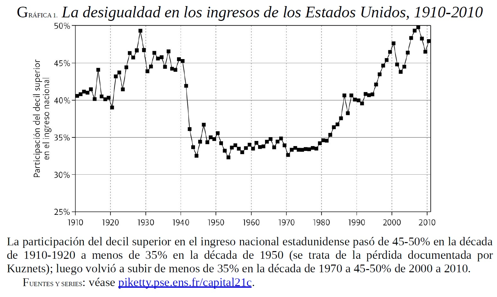
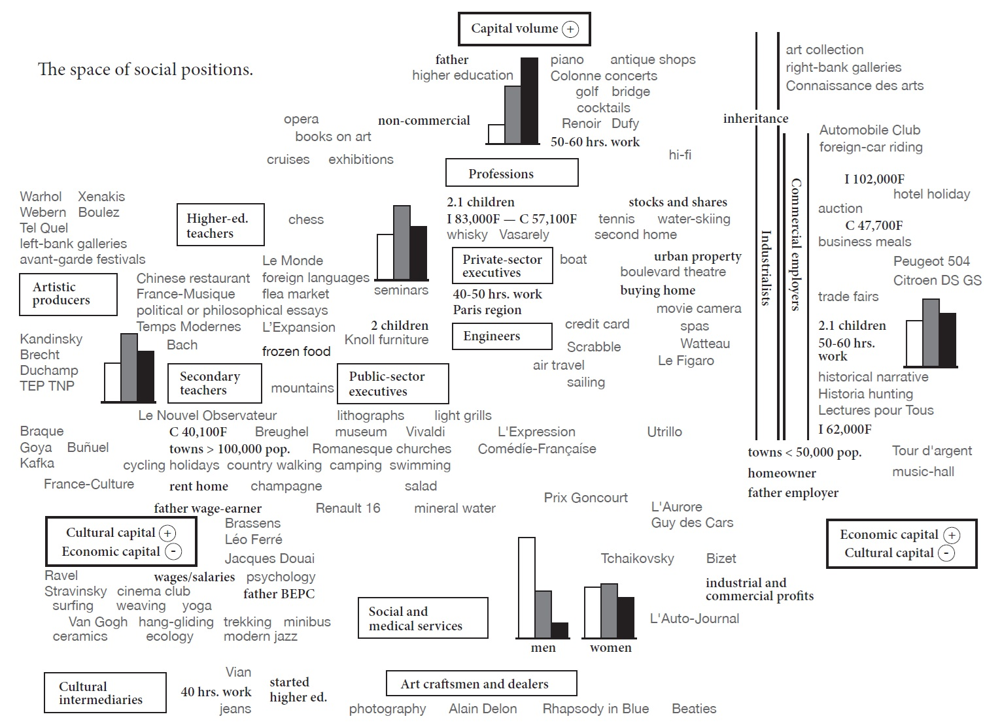
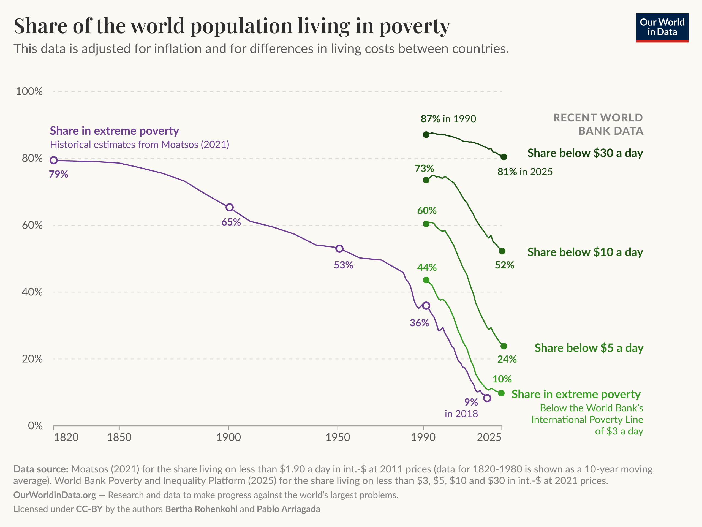
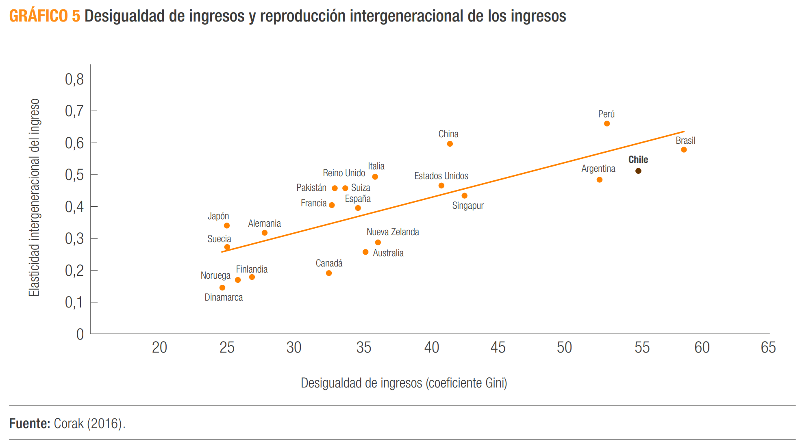
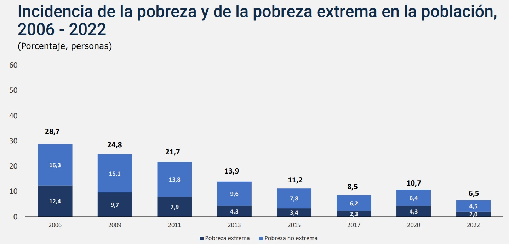
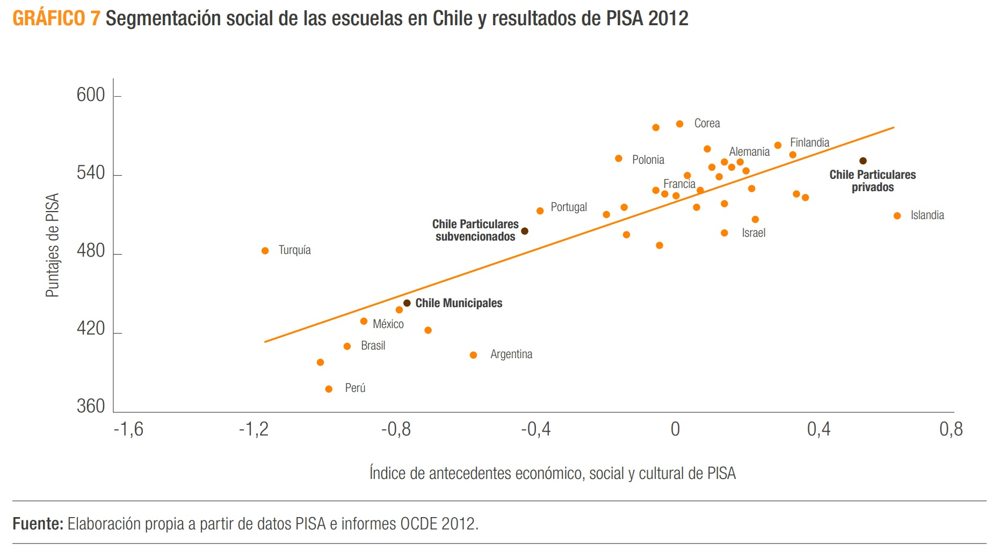

## Objetivos de la Sesión de Hoy {.smaller background-color="white"}

-   **Comprender** la visualización no solo como una ilustración, sino como una **forma de argumento sociológico**.
-   **Analizar** cómo "visualizaciones icónicas" han redefinido debates sobre la desigualdad.
-   **Demostrar** por qué los estadísticos resumen por sí solos pueden ser engañosos.
-   **Aprender** y aplicar un conjunto de **mejores prácticas** para la creación de gráficos claros y honestos.
-   **Introducir** la **"Gramática de Gráficos"** y sus componentes (`data`, `aes`, `geom`).
-   **Ampliar** el repertorio en `ggplot2` con una herramienta clave para la comparación: **el *faceting***.

---
title_slide_background: "#008080"
---

# 1. La Visualización como Argumento Sociológico

## Más Allá de la Ilustración {.smaller background-color="white"}

La visualización de datos no es un paso meramente técnico o decorativo al final de un análisis. En sociología, las visualizaciones más influyentes son, en sí mismas, **argumentos teóricos condensados**.

Tienen el poder de:

-   Contar una **historia** compleja de forma simple y memorable.
-   **Desafiar narrativas** dominantes sobre el progreso y la sociedad.
-   **Redefinir el debate** público y académico.

Como argumenta Mike Savage en *The Return of Inequality: Social Change and the Weight of the Past* (Harvard University Press, 2021), estas "visualizaciones icónicas" no solo muestran datos, sino que proponen una nueva forma de ver el mundo social.

::: {style="font-size: 0.65em; color: #aaa; margin-top: 1em;"}
Savage, M. (2021). *The Return of Inequality: Social Change and the Weight of the Past*. Harvard University Press. https://doi.org/10.2307/j.ctv31xf633
:::


## La Curva en U de Piketty (La Desigualdad en el Tiempo) {.smaller background-color="white"}

{fig-align="center"}

## La Curva en U de Piketty (La Desigualdad en el Tiempo) {.smaller background-color="white"}

-   **El Gráfico:** Una simple línea del tiempo (*sparkline*) que muestra la participación del 1% más rico en el ingreso nacional de EE.UU. a lo largo del siglo XX.

-   **El Argumento Visual:** La forma de **"U"** es una poderosa narrativa. Desafía la idea modernista de un progreso lineal y constante hacia una mayor igualdad. El gráfico *argumenta* que, tras un período de relativa equidad a mediados de siglo, estamos **"regresando"** a los niveles de desigualdad de la "Gilded Age". Hace visible **"el peso de la historia"** en el presente.


## El Espacio Social de Bourdieu (La Desigualdad en el Espacio) {.smaller background-color="white"}

{fig-align="center"}

## El Espacio Social de Bourdieu (La Desigualdad en el Espacio) {.smaller background-color="white"}

-   **El Gráfico:** No es una línea de tiempo, sino un **mapa**. Posiciona a grupos e individuos en un espacio bidimensional.
    -   **Eje Vertical:** Volumen total de capital (económico + cultural).
    -   **Eje Horizontal:** Composición del capital (más cultural a la izquierda, más económico a la derecha).

-   **El Argumento Visual:** Bourdieu *argumenta* que la desigualdad no es una simple jerarquía de ingresos. Es **multidimensional y relacional**. El gráfico muestra cómo los gustos y estilos de vida (música, arte, comida) no son meras preferencias personales, sino que **estructuran el espacio social** y reproducen las distinciones de clase.


## Ver para argumentar {.smaller background-color="white"}

Savage (2021) señala que Piketty usa el **tiempo** para argumentar que el pasado está regresando. Bourdieu usa el **espacio** para argumentar que la desigualdad es más que solo económica.

En ambos casos, el gráfico no es una simple ilustración del texto. Es el **núcleo de su argumento teórico**.

La visualización, por tanto, es una forma de hacer sociología.


## Veamos algunos otros ejemplos {.smaller background-color="white"}

{fig-align="center"}


## Veamos algunos otros ejemplos {.smaller background-color="white"}

{fig-align="center"}


## Veamos algunos otros ejemplos {.smaller background-color="white"}

{fig-align="center"}


## Veamos algunos otros ejemplos {.smaller background-color="white"}

{fig-align="center"}


# 2. La Visualización como Diagnóstico Estadístico

## El Engaño de los Estadísticos Descriptivos {.smaller background-color="white"}

Además de ser argumentos, los gráficos son herramientas de **diagnóstico** cruciales. Los estadísticos resumen por sí solos pueden ser idénticos para distribuciones radicalmente diferentes.

**Ejemplo: "El Trío Engañoso"**

Imaginemos tres grupos de datos con los siguientes estadísticos:

| Grupo | Media | Desv. Estándar |
| :--- | :--- | :--- |
| A (Notas de Examen) | 75.0 | 10.0 |
| B (Estaturas en cm) | 75.0 | 10.0 |
| C (Ingresos x10,000) | 75.0 | 10.0 |

Si solo miramos los números, podríamos pensar que las tres distribuciones son similares. Pero...

## ¡GRAFICA SIEMPRE TUS DATOS! {.smaller background-color="white"}

La visualización revela la verdadera estructura que los números ocultaban.

```{r, echo=FALSE, message=FALSE, warning=FALSE, fig.align='center'}
library(tidyverse)

temp <- tempfile() 
download.file("https://observatorio.ministeriodesarrollosocial.gob.cl/storage/docs/casen/2022/Base%20de%20datos%20Casen%202022%20SPSS.sav.zip", temp)
casen <- haven::read_sav(unz(temp, "Base de datos Casen 2022 SPSS.sav"))
unlink(temp); remove(temp)

casen <- casen %>%
  mutate(pobreza_factor = as_factor(pobreza))

set.seed(123)
grupo_a <- tibble(valor = rnorm(500, 75, 10), grupo = "A: Simétrico (Unimodal)")
grupo_b <- tibble(valor = c(rnorm(250, 65, 5), rnorm(250, 85, 5)), grupo = "B: Bimodal (Dos grupos)")
grupo_c <- tibble(valor = rexp(500, 1/10) * 5 + 30, grupo = "C: Asimétrico (con Outliers)")
trio_enganoso <- bind_rows(grupo_a, grupo_b, grupo_c)

# Para forzar medias y sd similares (haciendo trampa por pedagogía)
trio_enganoso <- trio_enganoso %>% group_by(grupo) %>%
  mutate(valor = scale(valor) * 10 + 75)

ggplot(trio_enganoso, aes(x = valor)) +
  geom_histogram(fill = "#008080", color = "white", bins = 20) +
  facet_wrap(~grupo, scales = "free_x") +
  labs(title = "El Trío Engañoso: Mismos Estadísticos, Diferentes Formas", x="", y="Frecuencia") +
  theme_minimal(base_size = 14) +
  theme(strip.text = element_text(face = "bold"))
```

**Lección:** La visualización es el único modo de detectar la **forma**, la **modalidad** y la presencia de **outliers**. Es un paso no negociable del análisis de datos.

---
title_slide_background: "#008080"
---

# 3. Mejores Prácticas en Visualización

## Principios para Gráficos Claros y Honestos {.smaller background-color="white"}

Un buen gráfico no solo muestra datos, sino que cuenta una historia de forma clara, precisa y honesta.

1.  **Maximizar la Razón "Tinta-Dato" (Edward Tufte):**
    -   Cada elemento visual debe comunicar información. Evita "ruido" como fondos recargados, sombras, efectos 3D o colores que no aportan significado.

2.  **Usar Títulos Informativos, no Descriptivos:**
    -   Un buen título resume el principal hallazgo o la historia del gráfico.
    -   *Mal título:* "Gráfico de barras de ingreso por región".
    -   *Buen título:* "El ingreso mediano en la RM es un 30% mayor que el promedio nacional".

3.  **Etiquetar Todo Claramente:**
    -   Ejes (con sus unidades: $, años, %), leyendas, y siempre citar la fuente.

## La Regla de Oro del Eje Cero {.smaller background-color="white"}

**Los gráficos de barras (y de áreas) SIEMPRE deben empezar en cero.**

Nuestros ojos interpretan la longitud o altura de la barra como proporcional a la cantidad que representa. Truncar el eje Y exagera las diferencias y es visualmente deshonesto.

```{r, echo=FALSE, message=FALSE, warning=FALSE, fig.align='center'}
set.seed(123)
data_barras <- tibble(
  grupo = c("A", "B", "C"),
  valor = c(85, 90, 100)
)
p1 <- ggplot(data_barras, aes(x = grupo, y = valor)) + geom_col(fill = "#008080") + labs(title = "Honesto: Eje Y empieza en 0") + theme_minimal(base_size=14)
p2 <- ggplot(data_barras, aes(x = grupo, y = valor)) + geom_col(fill = "#D76D77") + coord_cartesian(ylim = c(80, 105)) + labs(title = "Engañoso: Eje Y truncado") + theme_minimal(base_size=14)
gridExtra::grid.arrange(p1, p2, ncol = 2)
```
En el gráfico de la derecha, la barra C parece 3 o 4 veces más grande que la A, cuando la diferencia real es solo de un ~18%.

## Elige el Gráfico Adecuado {.smaller background-color="white"}

No todos los gráficos sirven para todo. La elección de la geometría depende del tipo de variable(s) que quieres mostrar.

-   **Una variable categórica:** **Gráfico de Barras**. Compara las frecuencias o porcentajes entre categorías.
-   **Una variable cuantitativa:** **Histograma** (para ver la forma), **Gráfico de Densidad** (versión suavizada) o **Boxplot** (para el resumen de 5 números).
-   **No uses gráficos de torta (Pie Charts).**
    -   **Razón:** El cerebro humano es muy malo para comparar ángulos y áreas, pero es excelente para comparar longitudes. La altura de las barras en un gráfico de barras es mucho más fácil de interpretar con precisión.


# 4. La Gramática de Gráficos con `ggplot2`

## Un Sistema para Construir Gráficos en Capas {.smaller background-color="white"}

`ggplot2` es un paquete de R que implementa la **"Gramática de Gráficos"**, una idea poderosa: en lugar de tener comandos rígidos para cada tipo de gráfico, tenemos un sistema de "bloques de construcción" que podemos combinar para crear cualquier visualización que imaginemos.

**Un gráfico en `ggplot2` es una superposición de capas.**

## Los 3 Componentes Esenciales {.smaller background-color="white"}

Toda visualización en `ggplot2` se construye a partir de tres componentes fundamentales:

1.  **Datos (`data`):** El `data.frame` que contiene la información que queremos visualizar.

2.  **Mapeos Estéticos (`aes`):** La conexión entre las **variables** de nuestros datos y las **propiedades visuales** (estéticas) del gráfico.
    -   `aes(x = edad, y = ytotcorh, color = sexo)`
    -   Esto le dice a `ggplot2`: "Usa la columna `edad` para el eje X, `ytotcorh` para el eje Y, y asigna un color diferente para cada valor de la variable `sexo`".

3.  **Geometrías (`geom`):** El objeto geométrico que usamos para representar los datos. Es la "forma" que toma nuestra visualización.
    -   `geom_point()`: para puntos.
    -   `geom_bar()`: para barras.
    -   `geom_histogram()`: para un histograma.

## La Plantilla Universal de `ggplot2` {.smaller background-color="white"}

La sintaxis siempre sigue esta plantilla:

`ggplot(data = <DATOS>, mapping = aes(<MAPEOS>)) + <GEOM_FUNCION>()`

-   **`ggplot(...)`**: Inicia el gráfico. Define la fuente de datos y los mapeos globales. **Crea un lienzo en blanco** con los ejes definidos, listo para recibir una geometría.
-   **`+`**: El operador para **añadir una nueva capa**.
-   **`geom_...()`**: Añade la capa de geometría que **dibuja los datos** en el lienzo.

## Construyendo por Capas: Ejemplo {.smaller background-color="white"}

**Paso 1: `ggplot()` crea el lienzo.** Le decimos qué datos usar y qué variables mapear a los ejes. El resultado es un plano cartesiano vacío.

```{r, echo=TRUE, message=FALSE, warning=FALSE, fig.align='center'}

# Capa 1: Datos y Estéticas
ggplot(data = casen, mapping = aes(x = edad))
```

## Construyendo por Capas: Ejemplo {.smaller background-color="white"}

**Paso 2: `+ geom_histogram()` añade la capa que dibuja.** Le decimos que represente los datos mapeados como un histograma.

```{r, echo=TRUE, message=FALSE, warning=FALSE, fig.align='center', fig.height=6}
# Capa 2: Geometría
ggplot(data = casen, mapping = aes(x = edad)) +
   geom_histogram(fill = "#40E0D0", color = "white", bins = 30)
```

## Mapear vs. Fijar {.smaller background-color="white"}

Este es el punto que causa más confusión al principio, pero es fundamental.

:::::: columns
::: {.column width="50%"}
**Mapear (DENTRO de `aes()`):**

-   El atributo visual **depende de una variable**.
-   Se usa para que el gráfico **represente información**.
-   **Ejemplo:**
    ```r
    ... aes(color = sexo) ...
    ```    Aquí, el **color** del punto dependerá de si el valor en la columna `sexo` es "Hombre" o "Mujer".
:::
::: {.column width="50%"}
**Fijar (FUERA de `aes()`):**

-   Asigna un **valor constante** al atributo.
-   Se usa para **mejorar la estética**.
-   **Ejemplo:**
    ```r
    ... geom_point(color = "blue")
    ```
    Aquí, **todos los puntos serán azules**, sin importar sus otras características.
:::
::::::

## Mapear vs. Fijar: Ejemplo Visual {.smaller background-color="white"}

Usemos el dataset `mtcars` para ver la diferencia de forma clara. Crearemos un gráfico de dispersión del peso (`wt`) vs. el rendimiento (`mpg`) de los autos.

:::::: columns
::: {.column width="50%"}
**Mapeando `color` a la variable `cyl` (cilindros)**

Aquí, el color **representa información**: nos dice cuántos cilindros tiene cada auto.
```{r, echo=TRUE, message=FALSE, warning=FALSE}
ggplot(mtcars, aes(x = wt, y = mpg, color = as.factor(cyl))) +
  geom_point(size = 4, alpha = 0.8) +
  labs(color = "Cilindros") +
  theme_minimal(base_size = 14) +
  theme(legend.position="bottom")
```
:::
::: {.column width="50%"}
**Fijando `color` a "blue"**

Aquí, el color es una **decisión estética**: todos los puntos son azules, sin importar sus datos.
```{r, echo=TRUE, message=FALSE, warning=FALSE}
ggplot(mtcars, aes(x = wt, y = mpg)) +
  geom_point(size = 4, alpha = 0.8, color = "blue") +
  theme_minimal(base_size = 14)
```
:::
::::::


## Ampliando la Gramática: Faceting (Small Multiples) {.smaller background-color="white"}

**El Problema:** ¿Qué pasa si queremos comparar la distribución del ingreso a través de las 16 regiones de Chile? Mapear 16 colores a una estética se vuelve un caos visual.

**La Solución: El Faceting (`facet_wrap()` o `facet_grid()`)**

Consiste en crear una **grilla de gráficos más pequeños**, donde cada panel muestra un subconjunto de los datos. Es una de las herramientas más poderosas de `ggplot2` para el análisis exploratorio.

```r
ggplot(datos, aes(x = ingreso)) +
  geom_histogram() +
  facet_wrap(~ region) # Crea un histograma separado para cada región
```

## Faceting en Acción {.smaller background-color="white"}

Ahora, usemos `facet_wrap()` para comparar la distribución del rendimiento (`mpg`) para cada tipo de cilindro (`cyl`). En lugar de usar colores en un solo gráfico, creamos un panel para cada categoría.

```{r, echo=FALSE, message=FALSE, warning=FALSE, fig.align='center', fig.height=5}
ggplot(mtcars, aes(x = mpg)) +
  geom_histogram(fill = "#008080", color = "white", bins = 5) +
  # La fórmula ~ cyl le dice a ggplot que cree un panel para cada valor de 'cyl'
  facet_wrap(~ cyl, labeller = labeller(cyl = c("4" = "4 Cilindros", "6" = "6 Cilindros", "8" = "8 Cilindros"))) +
  labs(
    title = "Distribución del Rendimiento (mpg) por Número de Cilindros",
    x = "Millas por Galón (mpg)",
    y = "Frecuencia"
  ) +
  theme_minimal(base_size = 14) +
  theme(strip.text = element_text(face = "bold"))
```


## Cierre y Próximos Pasos {.smaller background-color="white"}

::: {style="font-size: 0.8em; line-height: 1.2;"}
**Resumen de la sesión de hoy:**

-   La visualización es una forma de **argumento sociológico** y una herramienta de **diagnóstico estadístico** indispensable.
-   Crear gráficos efectivos y honestos requiere seguir **buenas prácticas**.
-   `ggplot2` usa una **"Gramática de Gráficos"** que nos permite construir visualizaciones complejas añadiendo capas (`data`, `aes`, `geom`).
-   El **faceting** es una técnica clave para comparar distribuciones a través de múltiples categorías.

**En el práctico de hoy:**

-   Aplicarán estos principios para diagnosticar datos, construir sus primeros gráficos con `ggplot2` desde cero y usar `facet_wrap` para análisis comparativos con la CASEN 2022.

**Adelanto de la Unidad 5:**

-   En la próxima unidad, dejaremos el análisis univariado y nos adentraremos de lleno en el **análisis bivariado**: cómo describir la relación entre *dos* variables.
::: 